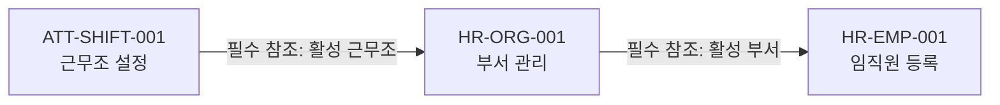

# AGENTS.md — 인사/근태 업무 문서화 지침

## 1. 적용 범위

이 파일은 다음 작업에 적용한다.

- 인사/근태 전체 화면 목록 작성
- 업무 프로세스 맵 작성
- 화면 간 선행·참조·후행 관계 분석
- 화면별 업무·액션 추출
- 액션별 권한 매트릭스 작성
- 정책·검증·예외·백엔드 처리 정의
- 엔티티 및 상태 전이 정의
- 정상·실패·취소·변경·중지·재처리 시나리오 검증

이 지침은 프로젝트 루트의 공통 `AGENTS.md`를 대체하지 않는다.  
화면 구현과 UIUX 판단에는 프로젝트 공통 지침을 계속 적용한다.

---

## 2. 분석 대상 소스

인사/근태 문서화 작업은 다음 소스를 우선 분석한다.

- 애플리케이션 진입점: `index.html`
- 인사 화면: `assets/js/page-hr-*.js`
- 근태 화면: `assets/js/page-att-*.js`
- 위 파일이 직접 참조하는 라우터, 메뉴, 스키마, 저장소, 공통 컴포넌트
- 화면의 Detail View, Modal, OffCanvas, Alert, Toast 관련 코드

관련성이 확인되지 않은 다른 업무 영역까지 분석 범위를 확장하지 않는다.

---

## 3. 기본 원칙

### 3.1 소스에서 확인된 사실과 업무 결정을 구분한다

HTML 또는 JavaScript에 화면, 버튼, 필드가 존재한다는 이유만으로 백엔드 처리와 업무 정책까지 추정하지 않는다.

각 항목은 다음 상태 중 하나로 표시한다.

| 상태 | 의미 |
|---|---|
| `확정` | 소스 또는 확정된 정책에서 확인됨 |
| `추정` | 소스 구조상 가능성이 있으나 확인되지 않음 |
| `미결정` | 업무 담당자의 결정이 필요함 |
| `권한 갭` | 현행 권한 관리 기능으로 표현하기 어려움 |
| `구현 갭` | 화면은 있으나 실제 처리 구현을 확인할 수 없음 |

### 3.2 화면 목록과 업무 프로세스를 구분한다

- 화면 목록은 시스템에 존재하는 UI 단위를 정리한다.
- 업무 프로세스는 사용자가 어떤 순서와 조건으로 업무를 수행하는지 정리한다.
- 메뉴 순서를 업무 순서로 간주하지 않는다.
- 선행 조건과 데이터 의존성이 확인된 경우에만 프로세스 관계로 연결한다.

### 3.3 기존 화면을 정책의 진실 공급원으로 간주하지 않는다

기존 HTML은 다음 내용을 확인하는 근거로 사용한다.

- 화면명
- 메뉴 경로
- 필드
- 버튼
- 탭
- 목록·상세 구조
- 화면 이동
- 프론트엔드 검증
- 현재 제공되는 사용자 액션

다음 내용은 소스에서 명확히 확인되지 않으면 `미결정`으로 기록한다.

- 백엔드 트랜잭션
- 데이터 저장 순서
- 상태 변경
- 자동 후속 처리
- 실패 시 롤백
- 재처리
- 소급 반영
- 권한의 실제 백엔드 검증
- 외부 시스템 연계

---

## 4. 필수 작업 절차

다음 순서를 준수한다.

### STEP 1. 인사/근태 화면 전체 목록 확인

다음 내용을 수집한다.

- 화면 ID
- 메뉴 경로
- 화면명
- 라우트
- 관련 HTML 또는 JavaScript 파일
- 화면 유형
- 주요 목적
- 주요 탭
- 분석 상태

### STEP 2. 화면 간 관계 연결

다음 관계를 구분한다.

| 관계 | 정의 |
|---|---|
| 선행 | 앞 업무가 완료되어야 뒤 업무를 수행할 수 있음 |
| 참조 | 앞 화면에서 생성한 데이터를 뒤 화면에서 사용함 |
| 후행 | 앞 업무의 처리 결과가 다음 업무로 연결됨 |
| 자동 처리 | 사용자 액션 이후 시스템이 자동으로 실행함 |
| 독립 | 다른 화면과 직접적인 의존성이 없음 |
| 미확정 | 소스만으로 관계를 확정할 수 없음 |

각 관계에는 전달하거나 참조하는 데이터를 함께 작성한다.

예:

```text
근무조 설정
→ 필수 참조: 활성 근무조
→ 부서 관리
→ 필수 참조: 활성 부서
→ 임직원 등록
```

### STEP 3. 업무 프로세스 맵 초안 작성

- 전체 프로세스 맵은 Markdown과 Mermaid를 함께 사용한다.
- Markdown 관계표를 상세 관계의 기준으로 사용한다.
- Mermaid는 관계를 한눈에 볼 수 있도록 시각화한다.
- 전체 지도는 프로세스 그룹 중심으로 작성한다.
- 화면이 많으면 프로세스별 상세 지도로 분리한다.
- 화살표에는 관계 종류와 전달 데이터를 표시한다.

프로세스 맵 초안을 작성한 후 다음 내용을 함께 제출한다.

- 확정된 연결 관계
- 추정된 연결 관계
- 미결정 관계
- 누락 가능성이 있는 자동 처리
- 업무 담당자 확인이 필요한 질문

사용자가 명시적으로 전체 작업을 계속하도록 요청하지 않은 경우, 프로세스 맵 검토 후 화면 상세 분석을 진행한다.

### STEP 4. 선행 화면부터 화면별 액션 추출

각 화면에서 실제로 확인되는 액션을 추출한다.

예:

- 조회
- 등록
- 수정
- 사용 중지
- 상태 변경
- 승인
- 반려
- 회수
- 취소
- 엑셀 다운로드
- 파일 다운로드
- 상세 조회
- 자동 생성
- 재처리

단순 버튼명만 복사하지 않고 해당 버튼이 수행하는 업무 의미를 기록한다.

### STEP 5. 화면별 액션 권한 매트릭스 작성

액션을 추출한 직후 권한 매트릭스 초안을 작성한다.

현행 권한 관리에서 지원하는 다음 권한에 우선 매핑한다.

- Read
- Create
- Update
- Delete
- Excel
- 컬럼 노출
- 컬럼 마스킹
- 버튼 노출

액션마다 신규 권한을 임의로 만들지 않는다.

현행 권한으로 분리하기 어려운 액션은 `권한 갭`으로 기록한다.

예:

```text
인사카드 기본정보 수정 → Update
퇴직 처리 → 현행상 Update
임금계약 변경 → 현행상 Update
```

퇴직 처리와 임금계약 변경을 일반정보 수정과 동일 권한으로 처리해도 되는지 별도 확인 사항으로 남긴다.

권한 매트릭스에는 다음 항목을 포함한다.

| 항목 | 설명 |
|---|---|
| 화면 ID | 권한이 적용되는 화면 |
| 액션 ID | 액션 식별자 |
| 액션명 | 실제 업무 행위 |
| 현행 권한 매핑 | Read/Create/Update/Delete/Excel |
| 적용 대상 | 소스에서 확인되는 권한 적용 대상 |
| 데이터 범위 | 본인·부서·사업장·전체 등 |
| 필드 제한 | 노출·마스킹·수정 제한 |
| 현행 지원 여부 | 지원·조건부·권한 갭 |
| 확인 사항 | 추가 결정이 필요한 내용 |

### STEP 6. 액션별 동작 상세 정의

각 액션은 다음 템플릿으로 작성한다.

```markdown
### [액션 ID] 액션명

- 화면:
- 화면 위치:
- 실행 주체:
- 필요 권한:
- 현행 CRUD 권한 매핑:
- 데이터 접근 범위:
- 필드 노출·마스킹:
- 입력:
- 참조 데이터:
- 선행 조건:
- 처리:
- 생성·변경 데이터:
- 출력·처리 결과:
- 후행 사용처:
- 상태 변경:
- 성공 시 사용자 알림:
- 검증 실패:
- 업무 예외:
- 시스템 실패 시 처리:
- 취소 처리:
- 재처리 가능 여부:
- 근거 소스:
- 확정 상태:
- 미결정 사항:
```

### STEP 7. 공통 내용 분리

화면별 액션을 분석하면서 반복되는 내용은 공통 문서로 분리한다.

- 화면에만 적용되는 정책: 해당 화면의 액션 문서
- 여러 액션에서 반복되는 정책: 공통 정책 문서
- 엔티티의 상태와 전이: 엔티티별 상태 문서
- 반복해서 생성·변경되는 데이터: 엔티티 문서
- 여러 화면에 적용되는 권한 기준: 공통 권한 문서
- 여러 화면에서 반복되는 실패 처리: 공통 예외 문서

모든 정책을 처음부터 별도 정책 ID로 분리하지 않는다.  
여러 화면 또는 여러 액션에서 재사용되는 정책만 공통화한다.

### STEP 8. 프로세스 전체 시나리오 검증

프로세스별 화면과 액션 정의가 끝나면 다음 시나리오를 검증한다.

- 정상 처리
- 선행 데이터 없음
- 중복 처리
- 검증 실패
- 중간 저장 실패
- 전체 취소
- 등록 후 변경
- 사용 중지
- 상태 변경
- 재처리
- 권한 없음
- 조회 범위 밖 데이터 접근
- 민감정보 권한 없음
- 화면 버튼을 거치지 않은 직접 요청
- 조회 후 저장 전에 참조 데이터가 변경된 경우
- 일부 데이터만 저장된 경우

검증 결과 발견된 누락 사항은 프로세스 맵, 액션 문서, 정책, 상태 또는 예외 문서에 반영한다.

---

## 5. UI 단위 포함 기준

### 5.1 전체 화면 목록에 포함

다음 UI는 화면 목록에 포함한다.

- 라우팅되는 주요 페이지
- 별도 업무를 수행하는 목록 화면
- 별도 업무를 수행하는 상세 화면
- 데이터를 생성·변경하는 Modal
- 데이터를 생성·변경하는 OffCanvas
- 여러 화면에서 공통으로 사용하는 업무성 팝업

### 5.2 전체 프로세스 맵에 포함

다음 항목만 전체 프로세스 맵의 주요 노드로 표현한다.

- 주요 업무 화면
- 독립적인 상세 업무
- 중요한 상태 변경
- 백엔드 자동 처리
- 외부 시스템 연계
- 프로세스 완료 결과

### 5.3 화면 상세 관계도에만 포함

다음 항목은 전체 프로세스 맵이 아니라 화면 상세 관계도에 포함한다.

- 등록·수정 Modal
- 승인·반려 Modal
- 상태 변경 OffCanvas
- 업무 데이터를 선택하는 공통 팝업
- 자체 필드·저장·검증이 있는 Detail View

### 5.4 독립 노드로 제외

다음 항목은 화면 또는 프로세스의 독립 노드로 만들지 않는다.

- 단순 확인 Alert
- 성공·실패 Toast
- 인라인 필드 오류
- 단순 안내 팝업
- 툴팁
- 도움말

확인 Alert는 화면 상세 흐름에서 조건 분기로 표현할 수 있다.  
Toast와 인라인 오류는 액션 명세의 결과 또는 검증 실패 항목에 기록한다.

---

## 6. 화면 유형 및 ID 규칙

UI 유형을 다음과 같이 구분한다.

| 유형 | 설명 |
|---|---|
| Page | 라우팅되는 주요 화면 |
| List | 목록 화면 |
| Detail | 상세 화면 |
| Modal | 모달 |
| OffCanvas | 우측 또는 좌측 상세 패널 |
| Popup | 별도 팝업 |
| Confirm | 확인 다이얼로그 |
| System | 자동 처리 또는 백엔드 처리 |

ID 예시:

```text
HR-EMP-001       임직원 관리
HR-EMP-001-D01   임직원 상세
HR-EMP-001-M01   휴직 등록 모달
HR-EMP-001-O01   임금계약 상세 OffCanvas
ATT-SHIFT-001    근무조 관리
```

Confirm, Toast, 인라인 오류에는 독립 화면 ID를 부여하지 않아도 된다.

---

## 7. 산출물 위치와 형식

기본 산출물 구조는 다음과 같다.

```text
docs/hr-attendance/
├─ AGENTS.md
├─ 00_SCREEN_CATALOG.md
├─ 01_PROCESS_MAP.md
├─ processes/
├─ screens/
├─ entities/
├─ policies/
├─ permissions/
├─ states/
├─ exceptions/
└─ templates/
```

산출물별 형식:

| 산출물 | 형식 |
|---|---|
| 전체 화면 목록 | Markdown 표 |
| 화면 관계 정의 | Markdown 표 |
| 프로세스 시각화 | Mermaid |
| 화면 액션 상세 | Markdown |
| 권한 매트릭스 | Markdown 표 |
| 정책 및 예외 | Markdown |
| 상태 전이 | Markdown 표 + Mermaid |
| 필드·코드·유형 프로필 | YAML |
| API 요청·응답 예시 | JSON |

---

## 8. 화면 목록 필수 항목

`00_SCREEN_CATALOG.md`에는 다음 항목을 포함한다.

| 필드 | 설명 |
|---|---|
| 화면 ID | 문서 식별자 |
| 메뉴 경로 | 전체 메뉴 위치 |
| 화면명 | 사용자 표시명 |
| 유형 | Page/List/Detail/Modal/OffCanvas |
| 상위 화면 | 하위 UI의 부모 화면 |
| 라우트 | 화면 진입 경로 |
| 소스 파일 | 관련 JavaScript 파일 |
| 주요 목적 | 화면이 수행하는 업무 |
| 프로세스 그룹 | 기초 설정·인사 운영·근태 운영 등 |
| 주요 액션 | 조회·등록·수정 등 |
| 분석 상태 | 확정·추정·미결정 |
| 근거 | 파일명·함수명·라우트 등 |

---

## 9. 화면 관계 필수 항목

화면 관계표에는 다음 항목을 포함한다.

| 필드 | 설명 |
|---|---|
| 출발 화면 | 데이터를 생성하거나 선행하는 화면 |
| 도착 화면 | 데이터를 사용하거나 후행하는 화면 |
| 관계 유형 | 선행·참조·후행·자동 처리 |
| 전달·참조 데이터 | 실제 연결되는 데이터 |
| 필수 여부 | 필수·선택·조건부 |
| 실패 영향 | 관계가 충족되지 않을 때의 영향 |
| 확인 상태 | 확정·추정·미결정 |
| 근거 | 확인한 소스 파일 및 함수 |

---

## 10. Mermaid 작성 규칙

- 전체 프로세스는 `flowchart LR`을 기본으로 한다.
- 단계가 많고 분기가 복잡하면 `flowchart TB`를 사용한다.
- 프로세스 그룹은 `subgraph`로 구분한다.
- 노드 ID는 영문과 숫자로 작성한다.
- 사용자 표시명은 한글을 사용한다.
- 화살표에는 관계와 전달 데이터를 표시한다.
- 확인되지 않은 관계는 `미결정`이라고 명시한다.
- 하나의 다이어그램에 지나치게 많은 화면을 넣지 않는다.
- 전체 지도와 프로세스별 상세 지도를 분리한다.
- 단순 Alert와 Toast를 독립 노드로 추가하지 않는다.

예:



---

## 11. 정책 작성 규칙

정책은 다음 위치에 작성한다.

| 정책 종류 | 작성 위치 |
|---|---|
| 특정 액션에서만 사용하는 정책 | 해당 화면 액션 문서 |
| 여러 액션에서 반복되는 정책 | `policies/` |
| 상태 변경 조건 | `states/` |
| 권한 조건 | `permissions/` |
| 공통 실패·복구 정책 | `exceptions/` |

정책을 화면마다 중복 작성하지 않는다.  
공통 정책을 참조할 때는 정책명 또는 정책 ID를 사용한다.

정책 문서에는 다음을 포함한다.

- 정책 목적
- 적용 대상
- 적용 조건
- 허용 처리
- 금지 처리
- 처리 결과
- 위반 시 사용자 표시
- 백엔드 처리
- 예외
- 미결정 사항

---

## 12. 상태 작성 규칙

상태는 화면이 아니라 엔티티별로 정의한다.

예:

```text
근무조 상태
부서 상태
근로관계 상태
임금계약 상태
근태 신청 상태
근태 마감 상태
```

동일한 `ACTIVE`라는 코드라도 엔티티별 의미가 다르면 별도로 정의한다.

상태 문서에는 다음을 포함한다.

- 상태 코드
- 표시명
- 업무 의미
- 진입 가능한 이전 상태
- 이동 가능한 다음 상태
- 상태 변경 액션
- 실행 주체
- 필요 권한
- 변경 조건
- 금지 조건
- 후행 처리
- 취소·복구 가능 여부

---

## 13. 엔티티 작성 규칙

엔티티는 단순한 화면이나 데이터베이스 테이블로 판단하지 않는다.

다음 중 하나 이상을 가지는 업무 데이터를 엔티티 후보로 본다.

- 고유한 식별자
- 독립적인 생성·변경 주기
- 상태
- 유효기간
- 변경 이력
- 다른 데이터와의 필수 관계

엔티티 문서에는 다음을 포함한다.

- 엔티티명
- 업무 정의
- 고유 식별자
- 주요 속성
- 다른 엔티티와의 관계
- 필수 참조
- 상태
- 유효기간
- 불변 규칙
- 생성·변경·중지 액션
- 이력 정책
- 삭제 정책
- 데이터 진실 공급원

---

## 14. 금지 사항

- 메뉴 순서를 업무 프로세스로 단정하지 않는다.
- HTML에 버튼이 있다는 이유로 백엔드 처리를 추정하지 않는다.
- 모든 Modal, Alert, Toast를 전체 프로세스 맵에 넣지 않는다.
- 모든 화면 정책을 처음부터 공통 정책으로 분리하지 않는다.
- 현행에 없는 액션 권한을 구현된 것처럼 작성하지 않는다.
- 상태 코드를 화면별로 중복 정의하지 않는다.
- 근거 없이 정상·실패·취소·재처리 동작을 확정하지 않는다.
- 미결정 사항을 임의로 결정하여 문서를 완성하지 않는다.
- 사용자의 명시적인 요청 없이 기존 HTML과 JavaScript를 수정하지 않는다.

---

## 15. 완료 보고

작업 완료 시 다음 내용을 사용자에게 보고한다.

- 확인한 화면 수
- 확인한 Detail·Modal·OffCanvas 수
- 확정된 화면 관계 수
- 추정 또는 미결정 관계 수
- 작성한 프로세스 수
- 추출한 액션 수
- 권한 갭 수
- 구현 갭 수
- 주요 미결정 사항
- 생성하거나 수정한 문서 파일
