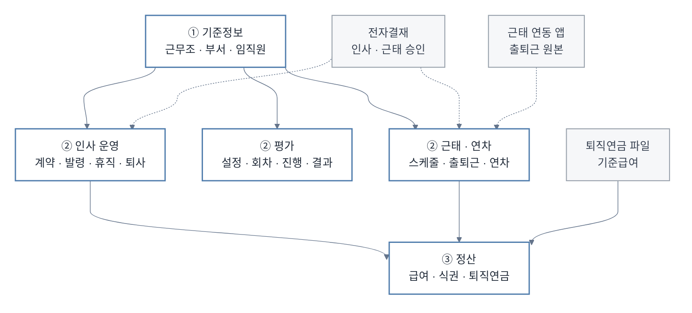
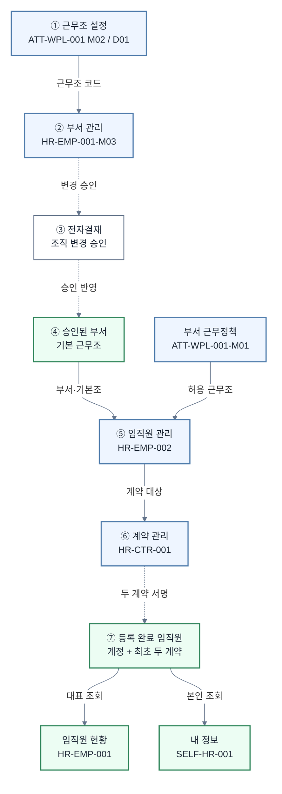
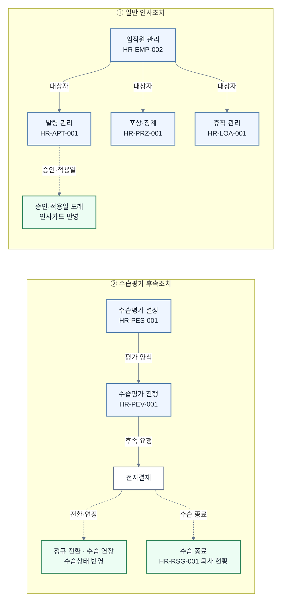
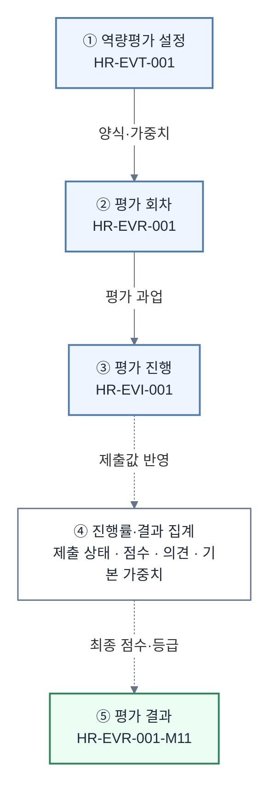
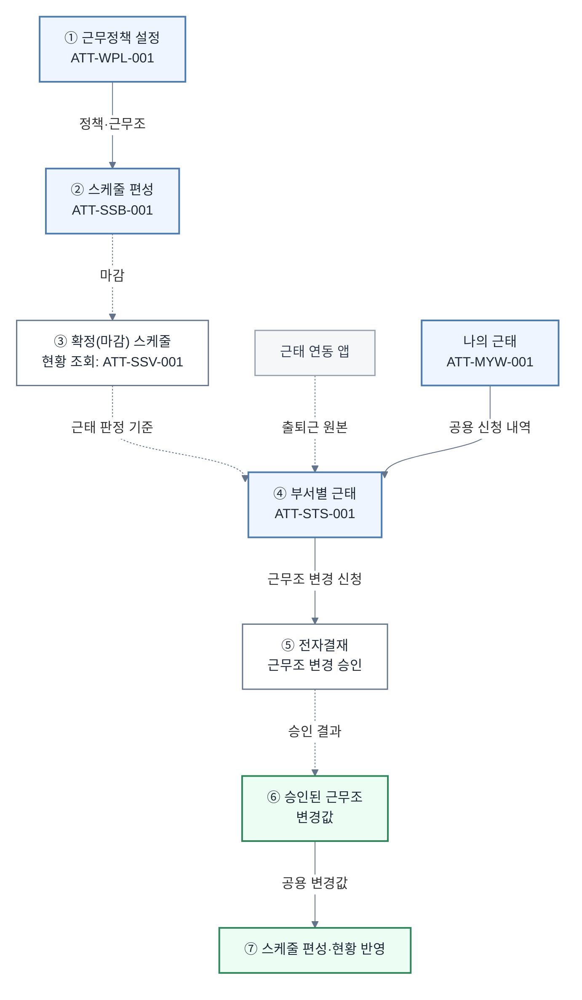
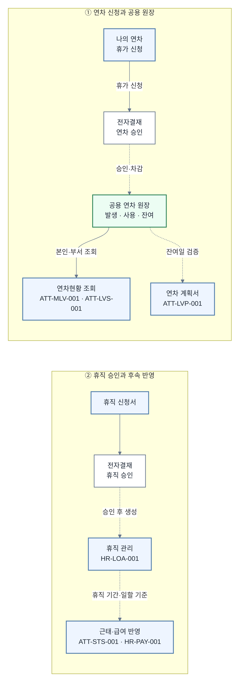
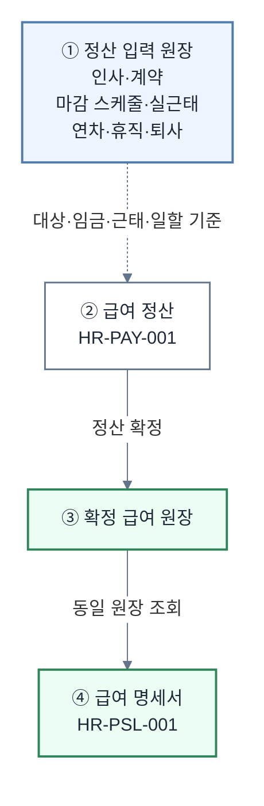
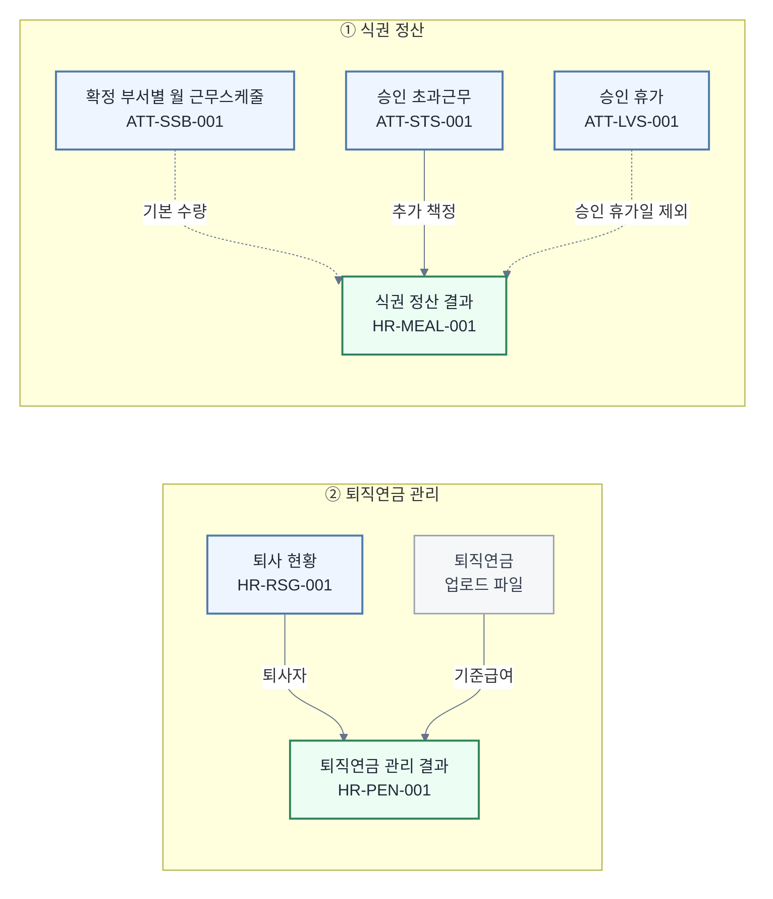

# 인사·근태 화면 간 참조·선행·후행 프로세스 맵 초안

> 단계: STEP 2 화면 간 관계 연결 + STEP 3 검토용 초안
>
> 기준일: 2026-07-15
>
> 범위: 활성 Page 25개와 그 하위 UI 86개(Detail 17, Modal 65, OffCanvas 4)
>
> 기준 자료: `00_SCREEN_CATALOG_IA_READABLE.md`, `00_SCREEN_CATALOG_REVIEW.md`, `index.html`, `assets/js/*.js`

---

## 1. 작성 기준

### 1.1 관계 유형

| 관계 유형 | 이 문서의 판정 기준 |
|---|---|
| 선행 | 앞 화면의 설정·등록·확정이 뒤 화면 업무 수행의 전제임 |
| 참조 | 앞 화면 또는 공용 모듈의 데이터를 뒤 화면이 읽음 |
| 후행 | 앞 업무의 처리 결과가 뒤 업무의 대상·상태·원장으로 이어짐 |
| 자동 처리 | 사용자 액션 뒤 별도 입력 없이 시스템이 다른 업무 데이터를 생성·변경함 |
| 독립 | 현재 코드상 다른 Page와 직접 데이터 의존성이 없음 |
| 미확정 | 프론트엔드 코드만으로 연결 또는 진실원을 정할 수 없음 |

### 1.2 확인 상태

| 확인 상태 | 의미 |
|---|---|
| 확정 | 실제 화면 이동, 공용 API 호출 또는 동일 상태 저장소 사용이 코드에서 확인됨 |
| 추정 | 업무 흐름상 가능성이 높지만 직접 호출·공용 저장소가 확인되지 않음 |
| 미결정 | 업무 정책 또는 외부 시스템 진실원 결정이 필요함 |
| 권한 갭 | 관계 수행에 필요한 권한 모델이 없음 |
| 구현 갭 | 화면 문구·업무 의도는 있으나 데이터 전달·상태 갱신 코드가 없음 |

### 1.3 범위 보정

- `index.html`과 `assets/js/nav-data.js`에 등록된 활성 Page만 화면 노드로 사용했다.
- 기존 초안에 있던 `HR-COD-001`, `ATT-SSA-001`, `ATT-LPS-001`, `ATT-WRC/WRM/WRS`, `ATT-EVT`는 현재 메뉴에서 제거된 화면이므로 활성 프로세스 노드에서 제외했다.
- `page-hr-eval-history.js`, `hr-members-data.js`, `hr-resign-data.js`, `att-shift-data.js` 등은 독립 Page가 아니라 공용 데이터 또는 하위 UI 제공 모듈로 분류했다.
- 메뉴 순서는 선후행의 근거로 사용하지 않았다. 실제 함수 호출, 공용 저장소, 화면 이동 코드만 `확정` 근거로 사용했다.
- `확정`은 프론트엔드 현재 구현 기준이다. 서버 저장·배치·권한·전자결재 콜백까지 보장한다는 의미는 아니다.

---

## 2. 전체 프로세스 지도

> 전체 지도는 업무 그룹만 표시한다. 실선은 확인된 참조, 점선은 구현이 필요한 연결이다. 화면별 데이터와 판정은 아래 관계표 및 상세 지도가 기준이다.

---

## 3. 화면 간 상세 관계표

| ID | 출발 화면 | 도착 화면 | 관계 유형 | 전달·참조 데이터 | 필수 여부 | 실패 영향 | 확인 상태 | 근거 |
|---|---|---|---|---|---|---|---|---|
| R01 | HR-EMP-001-M03 부서 관리 | HR-EMP-002 임직원 관리 | 선행·참조 | 활성 부서, 부서 ID·명칭, 조직 계층 | 필수 | 임직원 등록·편집 시 부서 선택 불가 또는 불일치 | 확정 | `App.HrDeptManage.getDepts()`를 `syncDeptsFromShared()`가 호출 (`page-hr-employee.js:1601`, `page-hr-info-mgmt.js:1035`) |
| R02 | HR-EMP-002 임직원 관리 | HR-EMP-001 임직원 현황 | 후행·참조 | 등록된 임직원, 인사카드 표시 가능 상태 | 필수 | 현황과 인사 마스터의 인원·상태 불일치 | 확정 | 현황이 `App.HRInfoMgmt.list()`와 `canRegisterCard()` 사용 (`page-hr-employee.js:79`) |
| R03 | HR-EMP-002 임직원 관리 | SELF-HR-001 내 정보 | 참조 | 로그인 사용자의 인사카드, 계약·입사서류 | 필수 | 본인 인사정보와 관리자 인사정보 불일치 | 확정 | `mountMyInfo()`, `currentUserEmp()`가 동일 `App.HRInfoMgmt` 사용 (`page-hr-info-mgmt.js:6379`, `:11547`) |
| R04 | ATT-WPL-001 근무정책 설정 | HR-EMP-002 임직원 관리 | 선행·참조 | 부서 근무정책, 허용 근무조, 기본 근무조, 시작·종료·휴게시간 | 필수 | 임직원 등록·부서 변경 시 기본 근무조 자동 적용과 근무조건 검증 불가 | 확정 | `App.AttWorkPolicy.deptPolicy/deptDefaultShift`, `App.AttShifts.get` 호출 (`page-hr-info-mgmt.js:7014`, `:7035`) |
| R51 | ATT-WPL-001-M02 / ATT-WPL-001-D01 근무조 설정 | HR-EMP-001-M03 부서 관리 | 선행·참조 | 등록된 근무조 코드·명칭·시작/종료·야간 여부, 부서 기본 근무조 코드 | 필수 | 부서별 기본 근무조를 선택할 수 없고 부서 추가·저장이 차단됨 | 확정 | 부서 관리가 `App.AttShifts.list()`로 선택지를 구성하고 기본 근무조 미선택 시 저장을 차단한 뒤 `setDeptDefaultShift()` 호출 (`page-hr-employee.js:1208`, `:1360`, `:1398`) |
| R52 | HR-EMP-001-M03 부서 관리 | System 전자결재·부서 마스터 | 후행·자동 처리 | 부서 추가·명칭·소속·계층·기본 근무조 변경안, 승인 결과 | 필수 | 승인 전 조직 변경이 즉시 반영되거나 승인 후 부서 마스터가 갱신되지 않음 | 구현 갭 | 업무 확정: 부서명·소속 변경은 부서 관리에서 요청하고 승인 후 반영. 현재 코드는 `saveEdit()`에서 로컬 조직과 기본 근무조를 즉시 변경 |
| R05 | HR-EMP-002 임직원 관리 | HR-CTR-001 계약 관리 | 선행·참조 | 계약 대상자, 고용형태, 계약기간·임금 입력값, 화면 이동 대상 사번 | 필수 | 계약 작성 대상 누락 또는 잘못된 직원 계약 생성 | 확정 | 계약 화면이 `App.HRInfoMgmt.list()` 사용, 인사카드가 `startEditorForEmp()`로 이동 (`page-hr-contract.js:2417`, `page-hr-info-mgmt.js:11193`) |
| R06 | HR-CTR-001 계약 관리 | HR-EMP-002 임직원 관리 | 후행·자동 처리 | 계정 등록, 최초 근로·임금계약 동시 서명 완료, 임직원 완료 상태 | 필수 | 계정과 최초 두 계약이 완료돼도 임직원 완료 상태가 갱신되지 않음 | 구현 갭 | 업무 확정: 계정 등록 + 최초 근로/임금계약 동시 체결이 완료 조건. 현재 발송 시 `contractLabor/contractWage`는 false 유지 (`page-hr-contract.js:2724`) |
| R07 | HR-EMP-002 임직원 관리 | System/Data `App.HRMembers` | 참조 | `App.HRInfoMgmt`의 동일 임직원 배열을 반환하는 호환 조회 | 필수 | 발령·포상·휴직·평가 등 기존 소비 화면의 직원 누락 | 확정 | `hr-members-data.js`가 별도 시드 없이 `App.HRInfoMgmt.list/isComplete/wageContractStatus`에 위임 |
| R08 | HR-EMP-002 임직원 관리 | ATT-STS-001 부서별 근태현황 | 후행·참조 | 재직 임직원 ID·성명·고용상태 | 필수 | 근태 대상자 명단 누락 | 확정 | `syncEmpList()`가 `App.HRInfoMgmt.list()`를 직접 읽어 동일 `EMP_LIST`에 반영 (`page-att-status.js:312`) |
| R09 | HR-EMP-002 임직원 관리 | ATT-STS-001 부서별 근태현황 | 자동 처리 | 직원의 실제 부서·조직 배치 | 필수 | 인사 부서와 근태 부서가 다르게 표시·집계됨 | 구현 갭 | `syncEmpList()`가 인사 부서값 대신 `App.AttOrg` 부서 풀로 재배정 (`page-att-status.js:312`) |
| R10 | HR-EMP-002 임직원 관리 | HR-APT-001 발령 관리 | 선행·참조 | 등록 완료 발령 대상자, 현 부서·직책·근무조건 | 필수 | 신규 등록 완료 직원이 발령 대상자 목록에 나타나지 않음 | 확정 | 발령의 `App.HRMembers.list()`가 R07 호환 어댑터를 통해 `App.HRInfoMgmt` 동일 배열 조회 (`page-hr-appoint.js:131`) |
| R11 | HR-APT-001 발령 관리 | HR-EMP-002 임직원 관리 | 후행·자동 처리 | 승인된 발령의 부서·직책·직급·근무조, 적용일 | 필수 | 승인·적용일 도래 후에도 직원의 소속 부서가 바뀌지 않음 | 구현 갭 | 업무 확정: 임직원 부서 변경은 발령 승인 후 적용일 도래 시 반영. 현재 `addAppointment()`는 발령 화면 `STATE`에만 추가 (`page-hr-appoint.js:1455`) |
| R12 | HR-EMP-002 임직원 관리 | HR-PRZ-001 포상·징계 | 선행·참조 | 활성 임직원, 대상자 인사카드 | 필수 | 신규 직원 대상 포상·징계 등록 불가 | 확정 | 포상·징계의 `App.HRMembers.list()`가 R07 호환 어댑터로 통합 마스터 조회 (`page-hr-prize-discipline.js`, `hr-members-data.js`) |
| R13 | HR-EMP-002 임직원 관리 | HR-LOA-001 휴직 관리 | 선행·참조 | 휴직 대상자, 부서·직책·인사카드 | 필수 | 신규 직원 휴직 이력 조회·연결 누락 | 확정 | 휴직의 `App.HRMembers.list()`가 R07 호환 어댑터로 통합 마스터 조회 (`page-hr-loa.js`, `hr-members-data.js`) |
| R14 | HR-EMP-002 임직원 관리 | HR-EVR-001 역량평가 회차 | 선행·참조 | 평가 대상자·평가자, 부서·직책 | 필수 | 신규 직원 평가 대상·평가자 편성 누락 | 확정 | 평가 회차의 `App.HRMembers.list()`가 R07 호환 어댑터로 통합 마스터 조회 (`page-hr-eval-round.js`, `hr-members-data.js`) |
| R15 | HR-EMP-002 임직원 관리 | HR-PEV-001 수습평가 진행 | 선행·참조 | 수습 대상자, 입사일, 직책자 여부 | 필수 | 통합 마스터 직원 외 데모 수습 대상자가 함께 노출됨 | 구현 갭 | 통합 마스터 호환 조회와 별도 `MOCK_PROB`를 합성 (`page-hr-eval-prob.js:145`) |
| R16 | HR-EVT-001 역량평가 설정 | HR-EVR-001 역량평가 회차 | 선행·참조 | 평가 양식, 단계 흐름, 단계별 기본 가중치, 등급·배분율 | 필수 | 회차 개설·수정과 결과 집계 기준 부재 | 확정 | 업무 확정: 설정의 단계별 기본 가중치로 집계. 회차가 `App.HREvalType.listForms/getForm`, `App.HREvalConfig` 사용 (`page-hr-eval-round.js`) |
| R17 | HR-EVR-001 역량평가 회차 | HR-EVI-001 역량평가 진행 | 선행·참조 | 진행 가능 회차, 대상 과업, 평가자·단계·입력기간 | 필수 | 평가 참여 회차와 과업을 열 수 없음 | 확정 | 진행 화면이 `App.HREvalRounds.listByStatus/get/getType` 사용 (`page-hr-eval-input.js:105`, `:273`) |
| R18 | HR-EVI-001 역량평가 진행 | HR-EVR-001 역량평가 회차 | 후행·자동 처리 | 임시저장·제출 상태, 단계별 완료 수, 회차 진행률 | 필수 | 제출했어도 관리자 진행 현황·완료율이 갱신되지 않음 | 구현 갭 | 제출은 로컬 `STATE.responses/submitted`와 `markSubmitted()`만 변경, 회차 진행률은 별도 계산 (`page-hr-eval-input.js:244`, `page-hr-eval-round.js:2352`) |
| R19 | HR-EVR-001 역량평가 회차 | HR-EVR-001-M11 평가 결과 | 후행·참조 | 종료·확정 회차 ID, 대상자 목록 | 조건부 | 결과 화면 진입 불가 | 확정 | 회차 화면이 `App.HREvalResult.open(roundId)` 호출, 결과 모달은 `page-hr-eval-history.js` 제공 |
| R20 | HR-EVI-001 역량평가 진행 | HR-EVR-001-M11 평가 결과 | 자동 처리 | 실제 제출 점수·의견 × 설정의 단계별 기본 가중치, 최종 점수·등급 | 필수 | 설정 가중치와 실제 제출값이 아닌 데모 결과가 표시됨 | 구현 갭 | 업무 집계 규칙은 확정됐으나 결과 모듈은 제출 응답 대신 회차·대상자 기반 mock 생성 (`page-hr-eval-history.js:13`) |
| R21 | HR-PES-001 수습평가 설정 | HR-PEV-001 수습평가 진행 | 선행·참조 | 직책자·비직책자 평가 양식과 버전 | 필수 | 수습평가 문항·배점 구성 불가 | 확정 | 양 화면이 `App.HRProbEval.getTemplates/getTemplate/saveTemplate` 공유 (`page-hr-eval-prob-set.js`, `page-hr-eval-prob.js`) |
| R22 | HR-PEV-001 수습평가 진행 | System 전자결재 | 후행 | 정규 전환·수습 연장·수습 종료 요청, 대상자·사유 | 조건부 | 후속 인사조치 승인 시작 불가 | 확정 | 수습평가 후속 액션이 전자결재 모달을 열고 pending 후속조치를 기록 (`page-hr-eval-prob.js:1144`) |
| R23 | System 전자결재 | HR-RSG-001 / HR-EMP-002 | 후행·자동 처리 | 수습 전환·연장·종료 승인 결과, 수습상태·퇴사 결과, 적용일 | 필수 | 승인 완료 후 수습상태·퇴사 현황이 갱신되지 않음 | 구현 갭 | 업무 확정: 수습 후속조치는 발령을 자동 생성하지 않으며, 수습 종료는 일반 퇴사와 같은 승인선·후속 처리 사용. 현재는 `session.postAction` pending만 기록 (`page-hr-eval-prob.js:1144`) |
| R24 | ATT-WPL-001 근무정책 설정 | HR-APT-001 발령 관리 | 선행·참조 | 발령지 부서 기본 근무유형·근무조 | 조건부 | 전보·배치 발령 시 근무조건 자동 제안 불가 | 확정 | 발령 화면이 목적 부서의 `deptPolicy/deptDefaultShift` 참조 (`page-hr-appoint.js:62`, `:754`) |
| R25 | ATT-WPL-001 근무정책 설정 | ATT-SSB-001 근무스케줄 편성 | 선행·참조 | 부서 정책, 활성 근무조, 기본 근무조, 휴일 | 필수 | 월 스케줄 생성·편성 기준 부재 | 확정 | 편성 화면이 `App.AttWorkPolicy`, `App.AttShifts`, 휴일 데이터를 사용 (`page-att-shift-batch.js`) |
| R26 | ATT-WPL-001 근무정책 설정 | ATT-SSV-001 근무스케줄 현황 | 선행·참조 | 부서 정책, 근무조 코드·시간 | 필수 | 현황의 근무조 표시·시간 해석 불가 | 확정 | 현황 화면이 `App.AttWorkPolicy`, `App.AttShifts` 사용 (`page-att-shift-status.js`) |
| R27 | ATT-WPL-001 근무정책 설정 | ATT-STS-001 부서별 근태현황 | 선행·참조 | 근무조, 근무시간, 휴일, 부서별 기본 근무조 | 필수 | 지각·조퇴·연장·휴일근무 판정 기준 부재 | 확정 | 근태 화면이 `App.AttShifts`, `App.AttWorkPolicy`, `App.AttHolidays` 사용 (`page-att-status.js`) |
| R28 | ATT-SSB-001 근무스케줄 편성 | ATT-SSV-001 근무스케줄 현황 | 후행·참조 | 확정(마감)된 월별 직원 근무조 배치 | 필수 | 편성 마감 결과와 조회 현황이 서로 다름 | 구현 갭 | 업무 기준은 확정(마감) 스케줄. 편성 `STATE.records/baseCodes`는 로컬이고 현황은 자체 `STATE.plan` 계산 (`page-att-shift-batch.js:286`, `page-att-shift-status.js`) |
| R29 | ATT-SSB-001 근무스케줄 편성 | ATT-STS-001 부서별 근태현황 | 선행·참조 | 일자별 확정(마감) 근무조, 적용 기간, 변경 이력 | 필수 | 근태 판정이 마감 스케줄이 아닌 기본 규칙으로 계산됨 | 구현 갭 | 업무 기준은 확정(마감) 스케줄. 근태는 `shiftCodeForDate()`로 자체 계산하고 편성 `STATE.records`를 참조하지 않음 (`page-att-status.js`) |
| R30 | ATT-MYW-001 나의 근태현황 | ATT-STS-001 부서별 근태현황 | 후행·참조 | 본인 소명·근태 신청, 신청 상태·이력 | 필수 | 본인 신청과 관리자 신청 현황 불일치 | 확정 | 나의 근태가 `App.AttStatus.myApps/appsByDate`와 공용 신청 모달 사용 (`page-att-my-work.js`, `page-att-status.js`) |
| R31 | ATT-MLV-001 나의 연차현황 | ATT-LVS-001 부서별 연차현황 | 후행·참조 | 연차 신청, 신청 상태, 취소·철회·처리 이력 | 필수 | 본인 신청과 부서 처리 목록 불일치 | 확정 | 두 화면이 `App.AttStatus.myApps/appsForEmp/setAppStatus` 공유 (`page-att-my-leave.js`, `page-att-leave.js`) |
| R32 | ATT-STS-001 근태·휴가 신청 | System 전자결재 | 후행 | 신청자, 신청 유형, 기간·시간, 사유, 첨부 | 조건부 | 승인 프로세스 시작 불가 | 확정 | 신청 제출 시 `App.openSystemApprovalModal()` 호출 (`page-att-status.js:2676`) |
| R33 | System 전자결재 | ATT-STS-001 / ATT-MYW-001 / ATT-LVS-001 | 후행·자동 처리 | 결재 상태, 승인·반려자, 처리일시, 의견 | 필수 | 전자결재 완료와 각 업무 화면의 신청 상태가 분리됨 | 구현 갭 | 업무 확정: 결재 완료 결과를 각 도메인 화면이 직접 반영. 현재 공용 결과 콜백 미확인, 연차 화면은 별도 수동 `setAppStatus()` 사용 |
| R34 | ATT-STS-001 근무조 변경 신청 | System 전자결재 | 후행 | 변경 대상일, 기존·요청 근무조, 사유 | 조건부 | 근무조 변경 승인 시작 불가 | 확정 | `submitShiftChange()`가 전자결재 모달 호출 (`page-att-status.js:2811`) |
| R35 | System 전자결재 | System/Data `App.AttShiftOverrides` | 후행·자동 처리 | 승인된 직원·요일별 근무조 override, 적용일 | 필수 | 승인 후 스케줄 현황에 변경 근무조가 반영되지 않음 | 구현 갭 | `App.AttShiftOverrides.approve()` API는 있으나 전자결재 제출 콜백에서 호출하지 않음 (`page-att-status.js:39`, `:2823`) |
| R36 | System/Data `App.AttShiftOverrides` | ATT-SSB-001 / ATT-SSV-001 | 참조 | 승인된 직원별 근무조 변경 override | 필수 | 승인 변경분이 편성·현황에 표시되지 않음 | 확정 | 두 스케줄 화면이 override 저장소를 읽음 (`page-att-shift-batch.js:748`, `page-att-shift-status.js:154`) |
| R37 | System 전자결재 휴직 신청서 | HR-LOA-001 휴직 관리 | 후행·자동 처리 | 승인된 신청자, 휴직 유형, 시작·종료일, 승인 문서 | 필수 | 승인 전 휴직 이력이 생성되거나 승인 후 이력이 누락됨 | 구현 갭 | 업무 확정: 전자결재 휴직 신청서에서 시작하고 승인 후에만 이력 생성. 현재 근태 신청 제출 시 `App.HRLoa.add()`를 즉시 호출하는 승인 가정 mock (`page-att-status.js:2418`) |
| R38 | HR-LOA-001 휴직 관리 | ATT-STS-001 / HR-PAY-001 | 참조·자동 처리 | 휴직 기간, 복직일, 유급·무급 구분, 근태·급여 제외 기준 | 필수 | 휴직자가 정상 근무·정상 급여 대상으로 계산됨 | 구현 갭 | `App.HRLoa` 이력은 존재하지만 근태·급여 화면의 소비 코드 미확인 |
| R39 | ATT-LVS-001 부서별 연차현황 | ATT-MLV-001 나의 연차현황 | 후행·참조 | 양 화면이 공유하는 발생·사용·잔여 연차 단일 원장 | 필수 | 같은 직원의 연차 잔여가 관리자·본인 화면에서 다름 | 구현 갭 | 업무 확정: 두 화면은 동일 연차 원장을 참조. 현재 잔여·발생 데이터는 각각 로컬 mock이고 신청 목록만 공유 |
| R40 | ATT-LVS-001 부서별 연차현황 | ATT-LVP-001 연차 계획서 | 선행·참조 | 가용 잔여일수, 승인 사용일, 계획 가능 일수 | 필수 | 잔여일을 초과한 계획이 등록됨 | 구현 갭 | 업무 확정: 잔여일 초과 계획 차단. 현재 계획서는 로컬 `STATE.plans`와 독립 계산 사용 (`page-att-leave-plan.js`) |
| R41 | System/Data 근태 연동 앱 | ATT-STS-001 부서별 근태현황 | 선행·참조 | 출근·퇴근 시각, 연동 출처, 원본 정정 이력 | 필수 | 연동 앱의 실근태 대신 생성된 데모 기록으로 판정·정산 | 구현 갭 | 업무 진실원은 근태 연동 앱으로 확정. 현재 근태 레코드는 `genMonthRecords()`로 생성되고 연동 API 미구현 (`page-att-status.js:902`) |
| R42 | HR-EMP-002 / HR-CTR-001 | HR-PAY-001 급여 정산 | 선행·참조 | 정산 대상, 고용상태, 계약 임금, 지급·공제 항목 | 필수 | 대상자 누락 또는 계약과 다른 급여 계산 | 확정 | 급여가 `App.HRInfoMgmt.list()`와 `canSettlePayroll()`로 대상·계약 자격을 동일 원본에서 판정 (`page-hr-pay-settlement.js:428`, `:3313`) |
| R43 | ATT-SSB-001 / ATT-STS-001 / ATT-LVS-001 / HR-LOA-001 / HR-RSG-001 | HR-PAY-001 급여 정산 | 선행·참조 | 확정 스케줄에 대응하는 실제 출퇴근, 승인 초과근무·휴가, 휴직·퇴사 일할 기준 | 필수 | 급여가 실제 근태·재직기간과 무관한 값으로 계산됨 | 구현 갭 | 업무 반영 범위는 모두 확정. 현재 근무상태·시간은 `mockWorkState()`와 결정적 mock이며 해당 원장 호출 없음 (`page-hr-pay-settlement.js:1353`, `:3376`) |
| R44 | System/Data 급여 항목·설정 | HR-PAY-001 급여 정산 | 선행·참조 | 활성 지급·공제 항목, 계산·반올림·지급 기준 | 필수 | 급여 항목 구성·계산 기준 부재 | 확정 | 급여가 `App.HRPayItem` 등 공용 설정 모듈 사용 (`page-hr-pay-settlement.js:414`) |
| R45 | HR-PAY-001 급여 정산 | HR-PSL-001 급여 명세서 조회 | 후행·참조 | 정산 회차, 직원별 확정 ledger, 지급·공제·실수령액 | 필수 | 직원 명세서 조회·인쇄 불가 또는 정산과 불일치 | 확정 | 명세서가 `App.HRPaySettlement.list()`를 직접 사용 (`page-hr-payslip.js:309`) |
| R46 | System/Data 퇴직연금 별도 업로드 파일 | HR-PEN-001 퇴직연금 관리 | 선행·참조 | 월 기준급여, 기업부담금, 적용 월·직원 식별자 | 필수 | 급여 원장값이 별도 업로드보다 우선되어 연금 부담금이 달라짐 | 확정 | 업무 확정: 별도 업로드 파일이 진실원이며 값 충돌 시 업로드 파일 우선. 화면은 업로드·적용 흐름 보유 (`page-hr-pension.js`) |
| R47 | HR-RSG-001 퇴사 현황 | HR-PEN-001 퇴직연금 관리 | 후행·참조 | 퇴사자, 퇴사일, 재직 종료 상태 | 필수 | 퇴사자 누계·중도인출·정산 대상 누락 | 확정 | 연금 화면이 `App.HRResign.list()`를 읽어 퇴사자를 보강 (`page-hr-pension.js:392`) |
| R48 | ATT-SSB-001 확정(마감) 부서별 월 근무스케줄 / ATT-STS-001 승인 초과근무 | HR-MEAL-001 식권 정산 | 선행·참조 | 부서별 월 근무일·근무조, 승인 초과근무 신청 | 필수 | 스케줄과 다른 기본 식권 수량이 책정되거나 초과근무 추가 지급이 누락됨 | 구현 갭 | 업무 확정: 월 식권 정산·재계산의 기준 데이터는 확정(마감)된 부서별 월 근무스케줄. 현재 화면은 `App.AttShifts`, `App.AttStatus.appsForEmp()`를 사용하고 공용 마감 스케줄 원장을 읽지 않음 (`page-hr-meal.js`) |
| R49 | ATT-LVS-001 승인 휴가 | HR-MEAL-001 식권 정산 | 참조·자동 처리 | 승인 휴가일, 식권 산정 제외 일수, 정산 월 | 필수 | 승인 휴가일에도 식권이 책정되어 지급 수량이 과다 계산됨 | 구현 갭 | 업무 확정: 승인받은 휴가 일수만큼 월 식권 산정에서 제외. 현재는 공용 승인 휴가 이력이 아닌 결정적 mock을 사용 (`page-hr-meal.js`의 `buildDeducts`) |
| R50 | System 전자결재 퇴사·수습종료 승인 | HR-RSG-001 / HR-EMP-002 | 후행·자동 처리 | 승인된 퇴사일·사유, 재직상태, 계정 종료, 승인 문서 | 필수 | 승인 결과가 퇴사 현황에 보이지 않고 인사 마스터가 재직으로 남음 | 구현 갭 | 업무 확정: 퇴사 현황은 전자결재 승인 결과 조회 화면이며 수습종료도 같은 승인선·후속 처리. 현재 `page-hr-leave.js`는 조회·삭제만 있고 승인 결과 `App.HRResign.add()` 연계 없음 |

---

## 4. 프로세스별 상세 지도

### 4.1 조직·임직원·계약

핵심 판단:

- 근무조 마스터를 먼저 등록해야 부서 관리에서 기본 근무조를 지정할 수 있고, 해당 기본값이 임직원 등록·부서 변경 시 자동 적용된다.
- 부서명·부서 소속·조직 계층 변경은 부서 관리에서 요청하되 전자결재 승인 후 부서 마스터에 반영한다.
- 임직원 개인의 소속 부서 변경은 부서 관리가 아니라 발령 승인 후 적용일 도래 시 반영한다.
- 임직원 기준정보의 단일 진실원은 `App.HRInfoMgmt`이며, `App.HRMembers`는 기존 소비 화면을 위한 호환 조회 어댑터로 정리했다.
- 계정 등록과 최초 근로·임금계약의 동시 서명 완료가 임직원 완료 조건이며, 급여 정산은 임금계약 완료를 필수로 한다.

### 4.2 발령·포상·휴직·퇴사·수습 후속조치

핵심 판단:

- 포상·징계, 발령, 휴직의 대상자 선택은 `App.HRMembers` 호환 API를 경유하지만 실제 데이터는 `App.HRInfoMgmt` 한 곳에서 조회한다.
- 발령 승인 후 적용일이 도래해야 인사카드의 부서·직책·직급을 변경한다.
- 수습 전환·연장·종료는 발령을 자동 생성하지 않는다. 전환·연장은 수습상태, 종료는 일반 퇴사와 동일한 승인선·후속 처리를 적용한다.
- 퇴사 현황은 신규 퇴사를 입력하는 화면이 아니라 전자결재에서 승인된 퇴사·수습종료 결과를 조회하는 화면이다.

### 4.3 역량평가

핵심 판단:

- 설정 → 회차 → 진행의 읽기 방향은 공용 API로 연결되어 있다.
- 최종 결과는 역량평가 설정의 단계별 기본 가중치로 제출값을 집계한다. 현재는 제출 응답·가중치 대신 mock 결과를 사용한다.

### 4.4 근무정책·스케줄·근태

핵심 판단:

- 근무정책·근무조는 편성·현황·근태의 공통 참조원이다.
- 근태 판정 기준은 확정(마감)된 스케줄이며, 현재 편성·현황·근태가 동일한 마감 스케줄을 공유하지 않는다.
- 전자결재 완료 결과는 각 도메인 화면이 직접 반영해야 하나 현재 승인 콜백과 상태 전이 연결이 없다.
- 실제 출퇴근 원본은 근태 연동 앱이며 현재 프론트엔드에는 연동 API가 없다.

### 4.5 연차·휴직

핵심 판단:

- 나의 연차현황과 부서별 연차현황은 발생·사용·잔여를 포함한 동일 연차 원장을 참조해야 한다.
- 연차 계획은 실제 잔여일을 참조하고 잔여일 초과 등록을 차단해야 한다.
- 출산휴가·육아휴직은 전자결재 휴직 신청서에서 시작하고 승인 후에만 휴직 이력을 생성한다.

### 4.6 급여·식권·퇴직연금

#### 4.6.1 급여 정산

#### 4.6.2 식권·퇴직연금

핵심 판단:

- 급여 → 명세서는 동일 정산 ledger를 사용하므로 후행 관계가 명확하다.
- 급여는 확정 스케줄에 대응하는 실제 출퇴근, 승인 초과근무·휴가, 휴직·퇴사를 모두 반영해야 하나 현재 해당 원장을 소비하지 않는다.
- 식권의 기본 수량은 확정(마감)된 부서별 월 근무스케줄로 산정하고, 승인 휴가일은 제외하며 승인 초과근무는 추가 책정한다. 현재 식권 화면은 공용 마감 스케줄·승인 휴가 원장을 소비하지 않는다.
- 퇴직연금 기준급여는 별도 업로드 파일이 진실원이며 급여 원장과 다르면 업로드 파일을 우선한다.

---

## 5. 확정·추정·미결정 요약

### 5.1 확정된 연결 관계 31건

- 조직·임직원·계약·인사조치: R01~R05, R07, R08, R10, R12~R14, R51
- 평가: R16, R17, R19, R21, R22
- 근무정책·스케줄·근태: R24~R27, R30~R32, R34, R36
- 급여·복리후생·퇴직연금: R42, R44~R47

### 5.2 추정된 연결 관계 0건

- 직접 코드 근거가 없는 관계는 낙관적으로 `추정` 처리하지 않고 `구현 갭` 또는 `미결정`으로 분리했다.

### 5.3 미결정 관계 0건

- 없음. R49는 승인 휴가일을 식권 산정에서 제외하는 정책으로 확정했다.

### 5.4 구현 갭 21건

- 임직원·계약·인사조치: R06, R09, R11, R15, R52
- 평가 결과·후속조치: R18, R20, R23
- 스케줄·근태·전자결재: R28, R29, R33, R35, R41
- 연차·휴직: R37~R40
- 급여·식권·퇴사: R43, R48~R50

### 5.5 독립성이 높은 화면

| 화면 | 현재 독립 범위 | 연결이 필요한 지점 |
|---|---|---|
| HR-PRZ-001 포상·징계 | 포상·징계 이력 자체는 화면 내부 관리 | 대상자는 호환 어댑터를 통해 통합 임직원 마스터 참조 완료 |
| ATT-LVP-001 연차 계획서 | 계획 등록·수정·삭제는 `STATE.plans` 내부 처리 | 실제 발생·사용·잔여 연차 참조 필요 |
| HR-PEN-001 퇴직연금 관리 | 별도 업로드·적용·중도인출 독립 원장 | 기준급여는 별도 업로드 파일 우선으로 확정 |
| HR-PSL-001 급여 명세서 조회 | 읽기 전용 후행 화면 | 급여 정산 원장이 확정되지 않으면 조회 불가 |

---

## 6. 누락 가능성이 높은 자동 처리

우선순위는 데이터 불일치가 여러 화면으로 확산되는 정도를 기준으로 정했다.

해소됨: 임직원 등록·수정 데이터는 `App.HRInfoMgmt`를 단일 진실원으로 사용하고, 기존 화면의 `App.HRMembers` 호출은 동일 배열을 반환하는 호환 어댑터로 전환했다.

| 우선순위 | 사용자 액션 | 필요한 자동 처리 | 현재 영향 화면 |
|---|---|---|---|
| P0 | 부서명·소속·계층 변경 승인 | 승인 후 부서 마스터와 기본 근무조 변경 반영 | 부서 관리, 임직원 등록, 근무정책 |
| P0 | 계정 등록 + 최초 근로·임금계약 동시 서명 | 인사카드 두 계약 플래그·임직원 완료상태 갱신, 임금계약 기준 급여 자격 판정 | 임직원 관리, 계약 관리, 급여 정산 |
| P0 | 근무스케줄 확정·마감 | 공용 마감 스케줄 저장소 생성, 현황·근태·급여가 동일 버전 참조 | 스케줄 편성, 스케줄 현황, 근태, 급여, 식권 |
| P0 | 전자결재 승인·반려 | 각 도메인 화면이 결재 상태·처리자·처리일시와 후속 결과를 직접 반영 | 근태, 연차, 휴직, 근무조 변경, 수습평가, 퇴사 |
| P0 | 퇴사 승인 | 퇴사 이력 생성, 재직상태·계정·급여·연금 대상 변경 | 퇴사 현황, 임직원, 급여, 퇴직연금 |
| P1 | 발령 확정·적용일 도래 | 부서·직책·직급·근무조 변경과 조직도 재집계 | 발령, 임직원 현황, 임직원 관리, 근태 |
| P1 | 평가 제출 | 회차 진행률·단계 완료·결과 원장 갱신 | 역량평가 진행, 회차, 결과 |
| P1 | 연차 승인·취소 | 발생·사용·잔여 원장 갱신, 계획 가능일·식권 차감 재계산 | 나의/부서별 연차, 연차 계획, 식권, 급여 |
| P1 | 휴직·복직 승인 | 근태 대상·급여 일할·식권·재직상태에 기간 반영 | 휴직, 근태, 급여, 식권, 임직원 |
| P2 | 급여 확정 | 확정 정산 원장 기준 급여 명세서 공개 | 급여 명세서 |

---

## 7. 확정된 업무 결정사항

### 7.1 기준정보·계약

- 서버 API·DB도 등록·현황·발령·평가·급여가 동일한 임직원 마스터를 사용한다.
- 임직원 완료 조건은 `계정 등록 + 최초 근로계약·임금계약 동시 서명 완료`다.
- 급여 정산 가능 여부는 임금계약 체결 상태를 필수로 판정한다.
- 근무조 설정에 등록된 근무조 코드·시간을 참조해야 부서 관리에서 부서별 기본 근무조를 지정할 수 있다.
- 부서명·부서 소속·조직 계층 변경은 부서 관리에서 요청하고 전자결재 승인 후 부서 마스터에 반영한다.
- 임직원 개인의 소속 부서 변경은 발령 승인 후 적용일이 도래할 때 반영한다.

### 7.2 평가·인사조치

- 역량평가 결과는 역량평가 설정의 단계별 기본 가중치로 제출값을 집계한다.
- 수습평가의 정규 전환·연장·종료 승인 시 발령을 자동 생성하지 않는다.
- 수습 종료와 일반 퇴사는 동일한 승인선과 후속 처리를 사용한다.

### 7.3 근태·연차

- 근태 판정은 확정(마감)된 근무스케줄을 기준으로 한다.
- 실제 출퇴근 원본은 별도의 근태 연동 앱에서 수신한다.
- 전자결재 완료 결과는 각 도메인 화면이 직접 반영한다.
- 나의 연차현황과 부서별 연차현황은 발생·사용·잔여를 포함한 동일 연차 원장을 참조한다.
- 연차 계획은 잔여일을 초과할 수 없다.
- 출산휴가·육아휴직은 전자결재 휴직 신청서에서 시작하며 승인 전 휴직 이력을 생성하지 않는다.

### 7.4 급여·복리후생·퇴사

- 급여는 확정 근무스케줄에 대응하는 실제 출퇴근, 승인 초과근무·휴가, 휴직, 퇴사를 모두 반영한다.
- 월 식권 정산·재계산은 확정(마감)된 부서별 월 근무스케줄을 기준 데이터로 사용한다.
- 승인받은 휴가 일수만큼 식권 산정에서 제외하고, 승인 초과근무는 추가 식권 책정에 반영한다.
- 퇴직연금 기준급여의 진실원은 별도 업로드 파일이며 급여 원장과 다르면 업로드 파일을 우선한다.
- 퇴사 현황은 전자결재에서 승인된 퇴사·수습종료 결과를 조회하는 화면이며 신규 퇴사를 직접 등록하지 않는다.

---

## 8. 검토 후 다음 단계

1. 확정된 업무 규칙과 구현 갭을 기준으로 프로세스 맵 검토를 종료한다.
2. `AGENTS.md`의 STEP 4에 따라 `근무조 설정 → 부서 관리 → 임직원 관리 → 계약 관리` 순서로 화면별 액션을 추출한다.
3. STEP 5에서 대표 전용 임직원 현황을 포함한 액션 권한 매트릭스를 작성한다.

---

## 9. 작성 결과 집계

| 항목 | 결과 |
|---|---:|
| 확인한 활성 Page | 25개 |
| 확인한 Detail / Modal / OffCanvas | 17 / 65 / 4개, 합계 86개 |
| 관계표 | 52건 |
| 확정 관계 | 31건 |
| 추정 관계 | 0건 |
| 미결정 관계 | 0건 |
| 구현 갭 | 21건 |
| 권한 갭 | 0건 — STEP 5 미수행 |
| 작성한 상세 프로세스 | 6개 |
| 추출한 액션 | 미집계 — STEP 4 범위 |

> 이 문서는 업무 결정사항을 반영한 검토본이다. R49를 포함한 미결정 정책을 모두 확정했으며, 다음 단계는 STEP 4 화면별 액션 추출이다.
