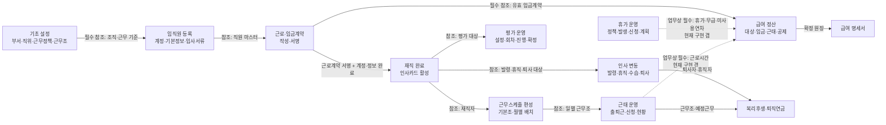
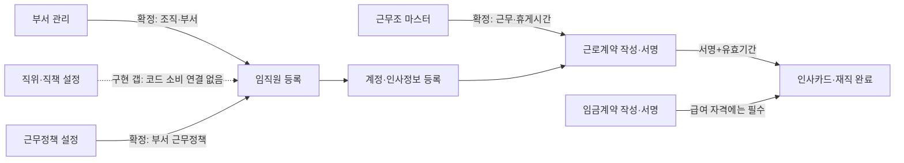
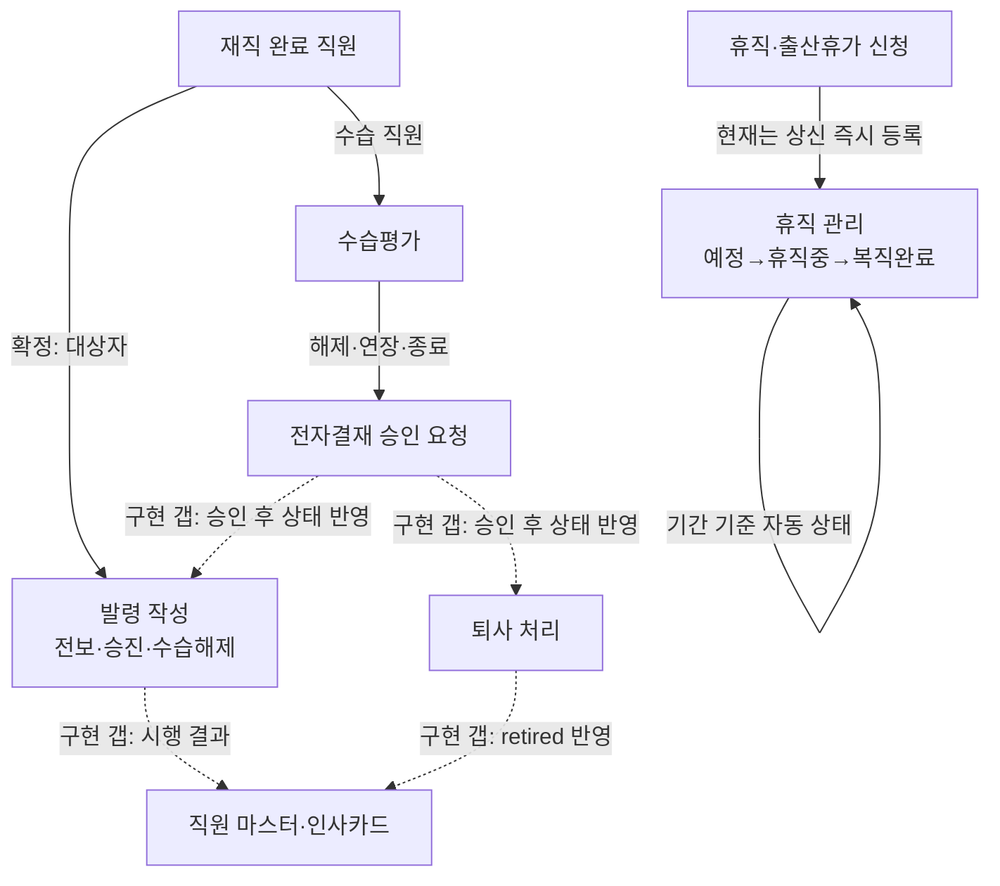
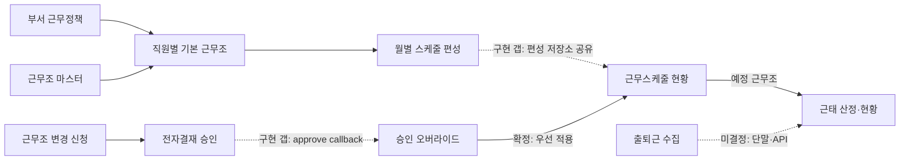
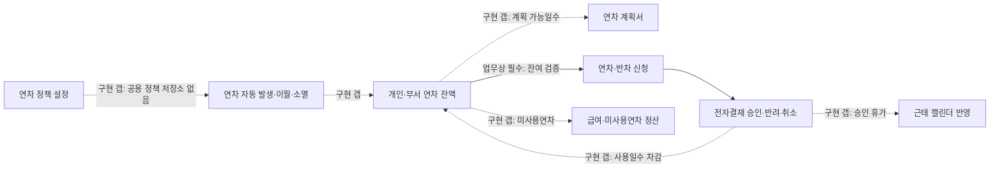
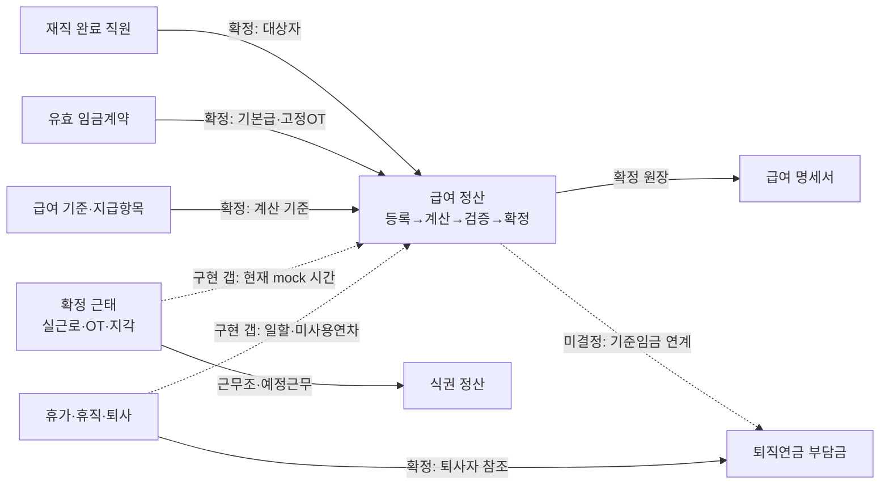
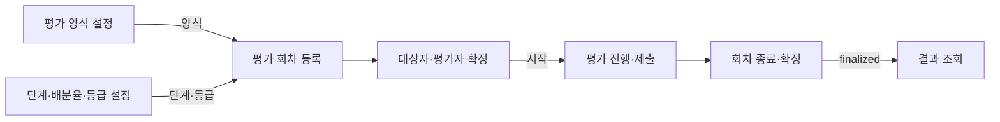
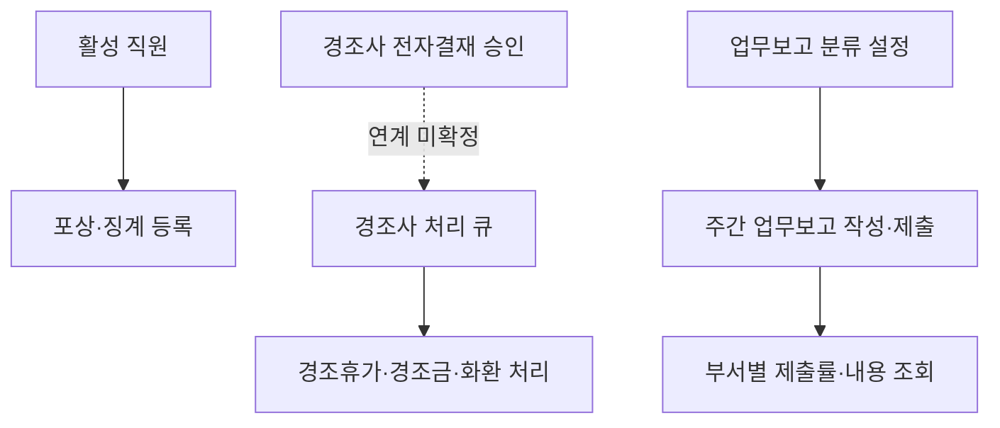

# 인사·근태 업무별 프로세스 맵

## 1. 범위와 판정 기준

이 문서는 화면 메뉴 순서가 아니라 소스에서 확인되는 데이터 의존성과 업무상 선행 조건을 기준으로 작성했다.

| 표시 | 의미 |
|---|---|
| 확정 | 화면 코드 또는 공유 API에서 실제 연결이 확인됨 |
| 추정 | 화면 설명과 구조상 관계가 유력하지만 실제 저장·호출 연결은 확인되지 않음 |
| 미결정 | 업무 담당자의 정책 결정이 필요함 |
| 구현 갭 | 업무상 연결이 필요하거나 화면은 있으나 실제 데이터 연결·후속 반영이 없음 |

## 2. 전체 업무 지도

### 전체 지도 해석

- 사용자가 예시로 제시한 `기초 설정 → 임직원 등록 → 계약 → 근태 → 급여` 흐름은 업무상 자연스럽다.
- 소스에서 `임직원 완료 + 유효 임금계약 → 급여 정산 대상`과 `급여 정산 원장 → 명세서`는 확정 연결이다.
- 그러나 `실제 근태·휴가·휴직 데이터 → 급여 계산`은 현재 급여 코드가 결정적 mock 시간을 생성하므로 구현 연결을 확인할 수 없다.
- 근태 현황 화면은 임직원 관리 명단과 근무조 마스터를 참조하지만 실제 출퇴근 수집 화면·단말·API는 분석 범위에서 발견되지 않았다.

## 3. 화면 관계 정의

아래 표가 화면 간 관계의 상세 기준이며 Mermaid는 이 표를 요약한 것이다.

| 관계 ID | 출발 화면 | 도착 화면 | 관계 유형 | 전달·참조 데이터 | 필수 여부 | 실패 영향 | 확인 상태 | 근거 |
|---|---|---|---|---|---|---|---|---|
| REL-001 | HR-EMP-001-M03 부서 관리 | HR-EMP-002 임직원 관리 | 참조 | 활성 부서, 조직 계층, 부서명·ID | 필수 | 직원 소속 선택·조직 필터 불가 | 확정 | `App.HrDeptManage.getDepts()`, `syncDeptsFromShared()` |
| REL-002 | HR-COD-001 직위·직책 설정 | HR-EMP-002 임직원 관리 | 참조 | 직위·직책 코드 | 필수 | 코드 불일치·수기 중복 가능 | 구현 갭 | `App.HRPositions`는 노출되지만 `page-hr-info-mgmt.js`에서 소비하지 않음 |
| REL-003 | ATT-WPL-001 근무정책 설정 | HR-EMP-002 임직원 관리 | 참조 | 부서 근무정책, 사용 근무조, 기본 근무조 | 조건부 | 근로정보 자동 채움·근무조 선택 불가 | 확정 | `App.AttWorkPolicy.deptPolicy()`, `deptDefaultShift()` 호출 |
| REL-004 | ATT-WPL-001 근무조 마스터 | HR-CTR-001 계약 관리 | 참조 | 근무조 코드, 근무·휴게시간 | 조건부 | 고정근무 계약 시간 자동 채움 불가 | 확정 | `App.AttShifts` 참조, 근무조 선택 Modal |
| REL-005 | HR-EMP-002 임직원 관리 | HR-CTR-001 계약 관리 | 선행·참조 | 직원 ID, 고용형태, 소속, 입사일 | 필수 | 계약 대상·본문 생성 불가 | 확정 | `App.HRMembers.list()`, `startEditorForEmp()` |
| REL-006 | HR-CTR-001 계약 관리 | HR-EMP-002 임직원 관리 | 후행 | 근로계약 서명 여부·유효기간, 임금계약 상태 | 필수 | 직원 `completed` 및 급여 자격 판정 불가 | 확정 | `isComplete()`, `canSettlePayroll()` |
| REL-007 | HR-EMP-002 임직원 관리 | HR-APT-001 발령 관리 | 선행·참조 | `status='completed'` 직원 | 필수 | 발령 대상 선택 불가 | 확정 | `loadEmployees()`가 완료 직원만 필터 |
| REL-008 | HR-APT-001 발령 관리 | HR-EMP-002 임직원 관리 | 후행 | 새 부서·직위·직책·발령 시행일 | 필수 | 발령 후 인사카드·조직도 불일치 | 구현 갭 | `App.HRAppoint.addAppointment()`는 발령 목록에만 추가 |
| REL-009 | HR-EMP-002 임직원 관리 | HR-EVR-001 역량평가 회차 | 참조 | 활성 직원, 직군, 부서, 직책 | 필수 | 대상자·평가자 자동 배정 불가 | 확정 | `App.HRMembers.list()`, `App.HREvalConfig` |
| REL-010 | HR-EVT-001 역량평가 설정 | HR-EVR-001 역량평가 회차 | 선행·참조 | 평가 양식, 평가 단계, 배분율, 직군별 등급 | 필수 | 회차 등록·평가자 배정·결과 등급 불가 | 확정 | `App.HREvalType`, `App.HREvalConfig` |
| REL-011 | HR-EVR-001 역량평가 회차 | HR-EVI-001 역량평가 진행 | 후행 | 시작된 회차, 평가 대상, 단계별 평가자 | 필수 | 개인 평가 할 일 생성 불가 | 확정 | `App.HREvalRounds.listByStatus()` |
| REL-012 | HR-EVI-001 역량평가 진행 | HR-EVR-001 역량평가 회차 | 후행 | 단계별 응답·점수·제출 상태 | 필수 | 회차 진행률·종료 판정 불가 | 추정 | 응답 저장 구조는 있으나 회차 진행률 일부가 결정적 mock |
| REL-013 | HR-EVR-001 역량평가 회차 | HR-EVR-001-M01 평가 결과 | 후행 | 확정 회차, 대상자, 양식·등급 | 필수 | 확정 결과 조회 불가 | 확정 | `App.HREvalResult.open(roundId)` |
| REL-014 | HR-PES-001 수습평가 설정 | HR-PEV-001 수습평가 진행 | 선행·참조 | 직책자·비직책자 양식과 버전 | 필수 | 수습평가 문항 구성 불가 | 확정 | `App.HRProbEval.getTemplates()/saveTemplate()` |
| REL-015 | HR-EMP-002 임직원 관리 | HR-PEV-001 수습평가 진행 | 선행·참조 | `probation=true`, 수습 시작·종료일 | 필수 | 자동 평가 세션 생성 불가 | 확정 | 수습직원 필터, 종료 14일 전 세션 생성 |
| REL-016 | HR-PEV-001 수습평가 진행 | 전자결재 | 후행 | 수습 해제·연장·종료 승인 요청 | 필수 | 후속 인사처리 확정 불가 | 확정 | `submitFollowupApproval()` |
| REL-017 | 전자결재 수습 후속 승인 | HR-APT-001·HR-RSG-001·HR-EMP-002 | 자동 처리 | 발령, 수습기간 갱신, 퇴사, 직원 상태 | 필수 | 평가 결과와 실제 인사 상태 불일치 | 구현 갭 | 승인 요청은 `session.postAction`만 기록, 대상 모듈 갱신 없음 |
| REL-018 | HR-EMP-002 임직원 관리 | ATT-STS-001 부서별 근태현황 | 참조 | 퇴사 제외 직원 명단 | 필수 | 근태 대상자 구성 불가 | 확정 | `App.AttStatus.syncEmpList()` |
| REL-019 | ATT-WPL-001 근무정책·근무조 | ATT-SSB-001 근무스케줄 편성 | 선행·참조 | 부서 허용 근무조, 기본 근무조 | 필수 | 기본·월별 스케줄 편성 불가 | 확정 | `App.AttWorkPolicy`, `App.AttShifts` 참조 |
| REL-020 | ATT-SSB-001 월별 근무스케줄 편성 | ATT-SSV-001 근무스케줄 현황 | 후행 | 직원·일자별 근무조 | 필수 | 편성 결과 조회 불가 | 구현 갭 | 두 화면이 월별 편성 저장소를 공유하지 않고 각자 `STATE` 사용 |
| REL-021 | ATT-SSV-001 근무스케줄 현황 | ATT-SSA-001 근무스케줄 배치 | 후행 | 선택 부서·월 | 선택 | 조회에서 편집 화면 진입 불가 | 확정 | `[근무조 설정]`/배치 버튼으로 hidden Page 진입 |
| REL-022 | ATT-STS-001-M03 근무조 변경 신청 | 전자결재 | 후행 | 현재·변경 근무조, 적용기간, 사유 | 필수 | 개인 변경 승인 불가 | 확정 | `submitShiftChange()` |
| REL-023 | 전자결재 근무조 변경 승인 | `App.AttShiftOverrides` | 자동 처리 | 직원·기간·승인 근무조 | 필수 | 승인 변경이 편성·현황에 반영되지 않음 | 구현 갭 | `approve()` API는 있으나 승인 callback 호출이 없음 |
| REL-024 | `App.AttShiftOverrides` | ATT-SSB-001·ATT-SSV-001·ATT-SSA-001 | 참조 | 일자별 승인 오버라이드 | 조건부 | 승인 변경보다 관리자 편성이 우선되는 오류 | 확정 | 세 화면의 `get()`·`onChange()` 사용 |
| REL-025 | ATT-WPL-001·ATT-SSB-001 | ATT-STS-001 근태현황 | 참조 | 예정 근무조, 시작·종료·휴게시간 | 필수 | 지각·조퇴·근무조 불일치 산정 불가 | 구현 갭 | 근무조 마스터는 참조하나 월별 편성 공유는 구현되지 않음 |
| REL-026 | 출퇴근 수집 시스템 | ATT-STS-001 근태현황 | 자동 처리 | 출근·퇴근 시각, 단말·수정 이력 | 필수 | 실제 근태 집계 불가 | 미결정 | 현재 `genMonthRecords()` 결정적 mock만 존재 |
| REL-027 | ATT-STS-001 근태·휴가·초과근무 신청 | 전자결재 | 후행 | 신청 코드, 기간·시간, 사유, 첨부, 결재선 | 필수 | 신청 승인·반려 불가 | 확정 | `submitApply()`, `submitOt()` |
| REL-028 | 전자결재 근태 신청 결과 | ATT-STS-001 신청 현황 | 자동 처리 | 승인·반려·취소 상태, 처리일시·사유 | 필수 | 현황과 실제 결재 결과 불일치 | 구현 갭 | 화면 내부 mock 상태만 있고 결재 결과 callback 없음 |
| REL-029 | ATT-STS-001 출산휴가 신청 | HR-LOA-001 휴직 관리 | 자동 처리 | 직원, 휴직 유형, 시작·종료일, 결재번호 | 조건부 | 승인 전 휴직 이력 생성 및 반려 시 잔존 가능 | 구현 갭 | `submitApply()`가 상신 즉시 `App.HRLoa.add()` 호출; 승인 결과 연결 없음 |
| REL-030 | HR-LOA-001 휴직 관리 | 근태·급여·조직 가용 인원 | 참조 | 휴직예정·휴직중·복직완료, 기간 | 필수 | 휴직자 근태·급여·배치 오류 | 구현 갭 | 휴직 상태 소비 로직 확인 불가 |
| REL-031 | ATT-LPS-001 연차 설정 | ATT-LVS-001·ATT-MLV-001 연차현황 | 선행·자동 처리 | 부여 기준, 가산, 이월·소멸, 적용일 | 필수 | 잔여연차 불일치 | 구현 갭 | 설정은 자체 `STATE.appliedPolicy`, 현황은 별도 `buildLeave()` mock |
| REL-032 | ATT-STS-001 연차 신청 결과 | ATT-LVS-001·ATT-MLV-001 연차현황 | 후행 | 승인 사용일수·취소·반려 | 필수 | 사용·잔여연차가 신청과 불일치 | 구현 갭 | 연차현황은 신청 저장소를 소비하지 않음 |
| REL-033 | ATT-LVS-001 연차 잔여 | ATT-LVP-001 연차 계획서 | 참조 | 사용 가능한 연차 | 필수 | 계획 초과 검증 오류 | 구현 갭 | 계획서는 고정 15일과 자체 `STATE.plans` 사용 |
| REL-034 | HR-EMP-002 임직원 완료·임금계약 | HR-PAY-001 급여 정산 | 선행·참조 | `completed`, 유효 근로·임금계약, 기본급·고정OT | 필수 | 대상자 제외 또는 임금 오산정 | 확정 | `listEmployeesMatchingFilter()`, `contractWageOf()` |
| REL-035 | ATT-STS-001 근태현황 | HR-PAY-001 급여 정산 | 참조 | 실근로·연장·야간·휴일·지각·조퇴 시간 | 필수 | 수당·차감 오산정 | 구현 갭 | 급여가 근태 API 대신 직원 순번 기반 mock 시간을 생성 |
| REL-036 | ATT-LVS-001·HR-LOA-001·HR-RSG-001 | HR-PAY-001 급여 정산 | 참조 | 유급·무급휴가, 휴직·퇴직일, 미사용연차 | 필수 | 일할·연차수당·무급 차감 오류 | 구현 갭 | 급여의 근로상태·미사용연차가 `mockWorkState()` 기반 |
| REL-037 | 급여 기준·지급항목 데이터 모듈 | HR-PAY-001 급여 정산 | 선행·참조 | 가산배율, 지급일, 지급항목, 과세·통상임금 정책 | 필수 | 계산식·지급항목 구성 불가 | 확정 | `App.HRPaySettings`, `App.HRPayItem` |
| REL-038 | HR-PAY-001 급여 정산 | HR-PSL-001 급여 명세서 | 후행 | 계산된 `ledger.rows`, 귀속월·지급일·지급·공제항목 | 필수 | 명세서 생성·조회 불가 | 확정 | `App.HRPaySettlement.list()` 소비 |
| REL-039 | ATT-WPL-001·ATT-STS-001 | HR-MEAL-001 식권 정산 | 참조 | 근무조 순근무시간, 예정근무·연차 | 필수 | 지급량·전월 차감 오산정 | 확정 | `App.AttShifts`, `App.AttStatus`를 직접 참조하며 데이터 자체는 mock |
| REL-040 | HR-RSG-001 퇴사 처리 | HR-EMP-002·ATT-STS-001·HR-PAY-001 | 자동 처리 | 직원 `retired`, 퇴사일, 계정 회수 | 필수 | 퇴사자가 재직·근태·급여 대상에 잔존 | 구현 갭 | `App.HRResign.add()`는 퇴사 이력만 추가하고 직원 마스터 미갱신 |
| REL-041 | HR-RSG-001 퇴사 현황 | HR-PEN-001 퇴직연금 | 참조 | 퇴사자, 퇴사일, 납입·중도인출 이력 | 조건부 | 퇴사자 정산·조회 누락 | 확정 | `App.HRResign.list()` 소비 |
| REL-042 | HR-PAY-001 급여 정산 | HR-PEN-001 퇴직연금 | 참조 | 기준임금·부담금 산정 기초 | 필수 여부 미결정 | 부담금 산정 근거 불일치 | 미결정 | 퇴직연금은 자체 `monthlyWage`·업로드 자료 사용 |
| REL-043 | ATT-WRC-001 업무보고 설정 | ATT-WRM-001 주간 업무보고 작성 | 선행·참조 | 부서별 업무 분류 양식 | 필수 | 보고 행 구성 불가 | 확정 | `App.WorkReport.categoriesFor(dept)` |
| REL-044 | ATT-WRM-001 주간 업무보고 작성 | ATT-WRS-001 업무보고 현황 | 후행 | 주차·작성자·부서·분류별 내용·제출 상태 | 필수 | 제출률·보고 내용 조회 불가 | 확정 | 공용 `App.WorkReport` 저장소 |
| REL-045 | 전자결재 경조사 승인 | ATT-EVT-001 경조사 현황 | 자동 처리 | 승인 신청, 경조 유형, 지원 항목 | 필수 | 인사총무 처리 큐 누락 | 추정 | 파일 헤더는 승인 완료 건 유입을 명시하나 실제 결재 연동 없음 |
| REL-046 | HR-EMP-002 임직원 관리 | HR-PRZ-001 포상·징계 | 참조 | 활성 직원, 인사카드 | 필수 | 대상자 선택·이력 연결 불가 | 확정 | `App.HRMembers.list()`, `App.HRInfoCard.open()` |

## 4. 업무별 상세 프로세스

### 4.1 기초 설정 → 입사 → 계약 → 재직 완료

핵심 판정:

- 일반 직원의 `completed`는 정보등록, 계정, 유효 근로계약 서명이 기준이다.
- 임금계약은 재직 완료 자체에는 필수가 아니지만 급여 정산 대상에는 필수다.
- 직위·직책 설정 화면은 단일 진실원이라고 주석되어 있으나 임직원 관리가 해당 API를 직접 읽지 않는다.

### 4.2 발령·수습·휴직·퇴사

핵심 판정:

- 발령 대상 제한은 확정이지만 발령 시행 결과가 직원의 소속·직위에 반영되는 코드는 없다.
- 수습평가 후속 처리는 결재 요청과 내부 이력까지만 있고 발령·퇴사·수습기간 변경으로 이어지지 않는다.
- 출산휴가는 승인 완료가 아니라 신청 상신 시 휴직 이력에 추가된다. 승인·반려 시점 정책을 확정해야 한다.
- 퇴사 처리는 퇴사 이력만 생성하며 직원 마스터를 `retired`로 변경하지 않는다.

### 4.3 근무정책·근무조 → 스케줄 → 근태

근무조 우선순위는 소스 주석상 `승인 오버라이드 > 관리자 월별 편성 > 기본 편성`이다. 다만 신청 승인 결과를 오버라이드에 넣는 배선과 월별 편성 화면 간 공유 저장소가 없다.

### 4.4 연차 정책 → 발생 → 계획 → 신청 → 잔액

현재 연차 설정, 부서별 연차, 나의 연차, 연차 계획은 서로 다른 인메모리 mock을 사용한다. 실제 구축에서는 연차 원장과 신청 결과가 하나의 진실 공급원이 되어야 한다.

### 4.5 근태·계약 → 급여 → 명세서·식권·퇴직연금

급여 정산 대상 자격과 계약 임금 연동은 강하게 구현되어 있다. 반대로 근태·휴가·휴직·퇴사 데이터는 실제 급여 계산에 연결되지 않고 직원 순번 기반 mock 값으로 계산된다.

### 4.6 역량평가

평가 흐름은 다른 업무보다 연결이 명확하다. 다만 평가 진행률 일부와 결과값은 스토리보드용 결정적 mock이므로 실서비스 응답 저장과 집계 트랜잭션은 미결정이다.

### 4.7 포상·징계, 경조사, 업무보고

업무보고 3개 화면은 공용 `App.WorkReport`를 사용해 연결이 확정되어 있다. 현재 메뉴는 임시 숨김 상태다. 경조사는 승인 완료 유입이라는 설명만 있고 실제 전자결재 연결은 확인되지 않는다.

## 5. 확정·추정·미결정 요약

| 관계 판정 | 수 |
|---|---:|
| 확정 | 27 |
| 추정 | 2 |
| 미결정 | 2 |
| 구현 갭 | 15 |
| 합계 | 46 |

### 5.1 확정된 주요 연결

- 부서 관리 → 임직원 관리 조직 트리
- 근무정책·근무조 → 인사카드 근로정보·계약 작성·스케줄 편성
- 직원 마스터 → 계약·발령·평가·근태·급여 대상자
- 유효 근로계약 → 재직 완료 판정
- 유효 임금계약 → 급여 정산 대상·기본급·고정OT
- 평가 양식·단계·등급 → 회차 → 개인 평가 → 확정 결과
- 급여 정산 원장 → 개인 급여 명세서
- 퇴사 이력 → 퇴직연금의 퇴사자 조회
- 업무보고 설정 → 작성 → 현황

### 5.2 추정된 연결

- 개인 평가 제출값이 평가 회차 진행률·확정 집계에 완전히 반영되는지
- 전자결재 승인 완료 경조사가 경조사 처리 큐에 자동 생성되는지
- 식권 정산이 실제 승인 연차와 예정 초과근무를 어떤 시점에 확정하는지

### 5.3 구현 갭

1. 직위·직책 코드 마스터 → 임직원 입력 선택지 연결
2. 발령 시행 → 직원 소속·직위·직책의 유효일자 반영
3. 수습평가 승인 → 수습 해제·연장·퇴사 실제 처리
4. 퇴사 처리 → 직원 마스터 `retired`, 권한·근태·급여 대상 제외
5. 월별 근무스케줄 편성 → 근무스케줄 현황 공유 저장소
6. 근무조 변경 승인 → `App.AttShiftOverrides.approve()` callback
7. 실제 출퇴근 수집 → 근태 기록 생성
8. 전자결재 승인·반려·취소 → 근태 신청 상태 동기화
9. 연차 정책 → 공용 연차 원장·발생·이월·소멸
10. 연차 신청 승인 → 잔여연차·근태 캘린더·계획 가능일수
11. 확정 근태·휴가·휴직·퇴사 → 급여 계산
12. 급여 기준임금 → 퇴직연금 부담금 산정
13. 출산휴가 신청이 승인 전 휴직 이력에 추가되는 시점 오류

## 6. 누락 가능성이 있는 자동 처리

- 입사 완료 시 인사카드 생성, 기본 권한·계정·부서·근무조 활성화
- 계약 서명·만료·무효화 시 직원 상태와 급여 자격 재평가
- 미래 발령일 도래 시 직원 조직·직위 유효이력 반영
- 휴직 시작·복직일 도래 시 근태 대상·급여 일할·권한 상태 자동 전환
- 퇴사일 도래 시 계정 잠금, 권한 회수, 근태·급여·평가 대상 제외, 자산 반납 후속
- 연차 정책 적용일 도래 시 개인별 발생 원장 생성
- 승인된 휴가·초과근무·근무조 변경을 스케줄·근태·급여에 반영
- 근태 마감 후 급여 정산에 확정 스냅샷 전달
- 급여 확정 후 명세서 공개, 회계 전표·이체 자료·퇴직연금 기초자료 생성
- 실패한 자동 처리의 재처리 큐, 부분 저장 롤백, 중복 방지

## 7. 업무 담당자 확인 질문

1. 인사 직원 마스터의 단일 진실 공급원은 `App.HRMembers`와 `App.HRInfoMgmt` 중 무엇으로 확정할 것인가?
2. 부서·직위·직책·근무지·근무조의 유효일자 이력을 별도 엔티티로 관리할 것인가?
3. 발령은 승인 즉시 반영인가, 발령 시행일 배치 반영인가?
4. 휴직 신청은 전자결재 승인 시 휴직 이력을 생성할지, 상신 시 예정 이력을 생성하고 반려 시 삭제할지?
5. 복직은 예정일 자동 완료인가, 복직 확인 액션이나 별도 발령이 필요한가?
6. 퇴사 처리는 승인 완료와 퇴사일 도래 중 어느 시점에 계정·권한·급여·근태 대상에서 제외할 것인가?
7. 실제 출퇴근 데이터는 어떤 단말·API·수정 승인 흐름을 진실 공급원으로 사용할 것인가?
8. 근태 마감 단위와 마감 해제·재산정 권한은 무엇인가?
9. 연차 발생은 회계연도·입사일 기준을 혼용할 수 있는가? 소급 정책 변경 시 기존 원장을 재계산하는가?
10. 휴가·휴직·결근의 유급·무급·급여 일할 규칙은 고용형태별로 어떻게 다른가?
11. 근무조 변경 승인은 신청기간 전체를 잠글지, 월별 편성 담당자가 예외 수정할 수 있는가?
12. 급여 계산 시 근태·연차·휴직·퇴사의 어느 마감 스냅샷을 사용할 것인가?
13. 급여 확정 후 정정은 기존 회차 재오픈, 차액 정산 회차, 다음 달 이월 중 어떤 방식인가?
14. 퇴직연금 부담금은 급여 원장의 기준임금으로 자동 산정할지 외부 고지액 업로드를 진실 공급원으로 할지?
15. 현재 숨김 화면인 연차 설정·경조사·업무보고·근태코드·직위직책을 다시 노출할지, 시스템 관리로 완전히 이관할지?

## 8. 다음 단계

이 문서는 `AGENTS.md` STEP 3의 검토용 초안이다. 관계와 미결정 사항을 업무 담당자가 검토한 뒤, 선행 화면부터 화면별 액션·권한 매트릭스·정책·상태·예외 상세 분석을 진행한다.
