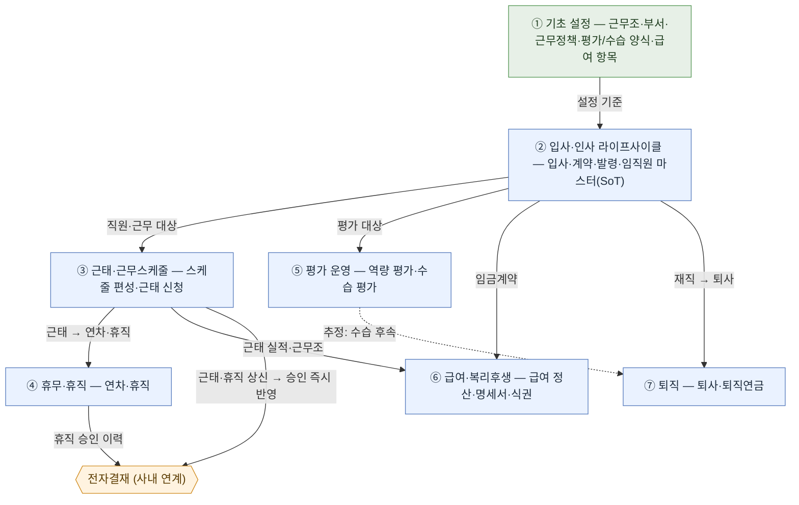
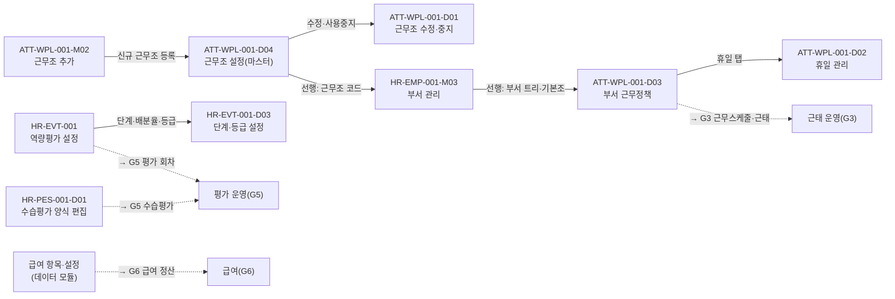
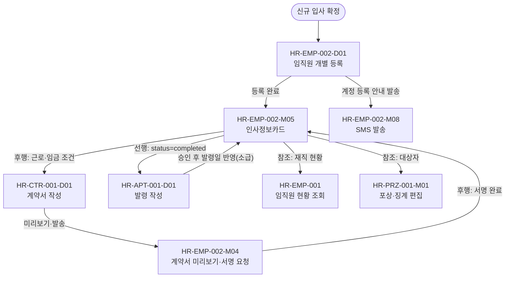
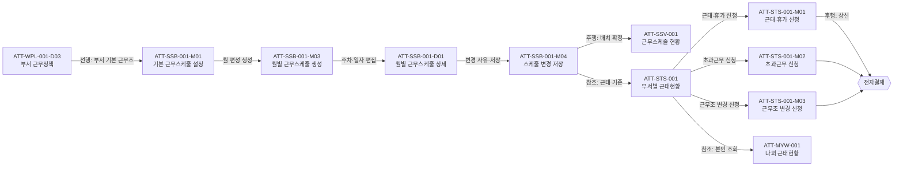
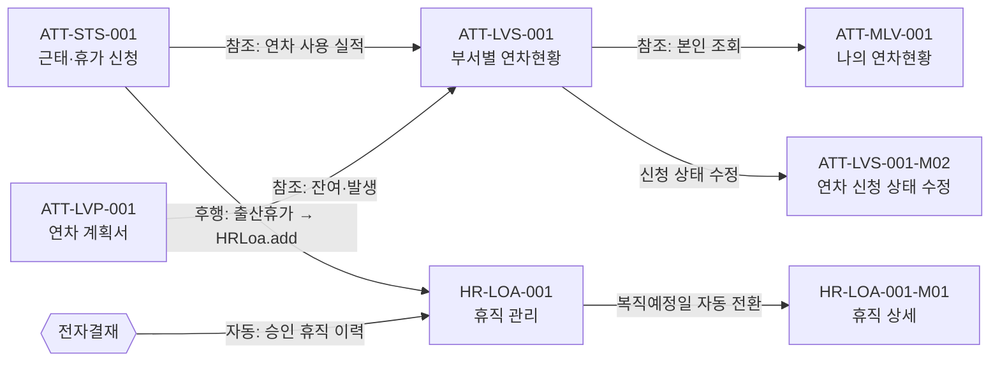
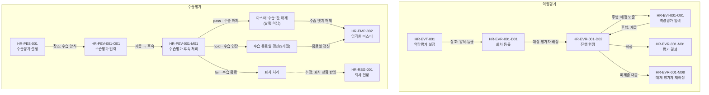
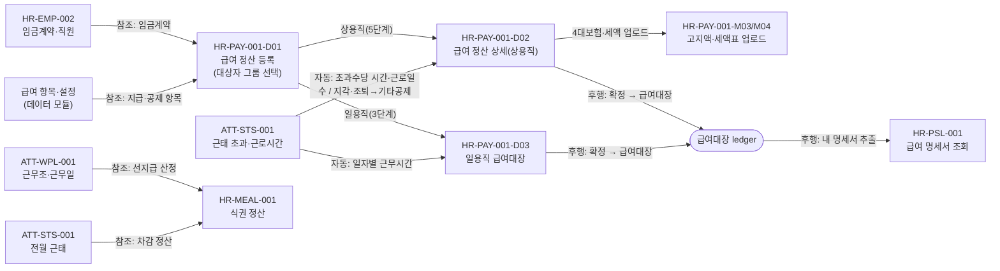
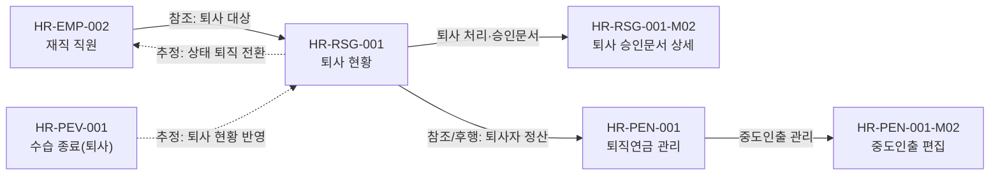

# 인사·근태 전체 프로세스 맵 — 초안

> STEP 2(화면 관계) + STEP 3(프로세스 맵 초안) 산출물입니다.
> 기준 문서: [00_SCREEN_CATALOG_REVIEW.md](00_SCREEN_CATALOG_REVIEW.md) · [00_SCREEN_CATALOG_IA_READABLE.md](00_SCREEN_CATALOG_IA_READABLE.md)
> 기준일: 2026-07-16 · 분석 대상 커밋: `eae0ad4`

---

## 1. 문서 기준

- 이 문서는 **화면이 아니라 업무 흐름**을 정리한다. 메뉴 순서를 업무 순서로 간주하지 않는다.
- 관계는 소스에서 **데이터 의존성(선행 조건·참조 데이터)이 확인된 경우에만** 연결한다.
- 관계 확인 상태는 다음 3단계로 표기한다.

| 상태 | 의미 |
|---|---|
| `확정` | 소스에서 데이터 참조·호출 관계가 확인됨 |
| `추정` | 소스 구조상 관계가 있으나 백엔드 후속 처리·자동 반영을 확인할 수 없음 |
| `미결정` | 업무 담당자의 결정 또는 외부 시스템(전자결재) 연계 확정이 필요함 |

- 프론트엔드에서 확인된 데이터 참조는 `확정`으로 표기하되, 이는 **화면이 데이터를 읽거나 넘긴다**는 뜻이며 백엔드 트랜잭션·상태 저장·권한 검증까지 확정한다는 뜻은 아니다.
- 근거는 `page-*.js` 파일과 `App.*` 데이터 저장소(네임스페이스) 참조로 표기한다.

---

## 2. 프로세스 그룹 정의

전체 25개 Page를 업무 흐름 관점에서 7개 프로세스 그룹으로 묶는다. 전체 프로세스 맵은 이 그룹을 노드로 사용하고, 그룹 안의 화면 간 상세 관계는 4절 관계표와 5절 상세 지도에서 다룬다.

| 그룹 | 명칭 | 성격 | 포함 Page |
|---|---|---|---|
| **G1** | 기초 설정 | 다른 업무의 선행 마스터 | `HR-EMP-001`(부서 관리 모달), `ATT-WPL-001`, `HR-EVT-001`, `HR-PES-001`, 급여 항목·설정(데이터 모듈) |
| **G2** | 입사·인사 라이프사이클 | 임직원 생성·계약·발령의 핵심 흐름 | `HR-EMP-002`, `HR-CTR-001`, `HR-APT-001`, `HR-EMP-001`, `HR-PRZ-001` |
| **G3** | 근태·근무스케줄 운영 | 근무조 배치·근태 신청·집계 | `ATT-SSB-001`, `ATT-SSV-001`, `ATT-STS-001`, `ATT-MYW-001` |
| **G4** | 휴무·휴직 운영 | 연차·휴직 관리 | `ATT-LVS-001`, `ATT-MLV-001`, `ATT-LVP-001`, `HR-LOA-001` |
| **G5** | 평가 운영 | 역량·수습 평가 실행 | `HR-EVR-001`, `HR-EVI-001`, `HR-PEV-001` |
| **G6** | 급여·복리후생 | 급여 정산(상용직·일용직)·명세서·식권 | `HR-PAY-001`, `HR-PSL-001`, `HR-MEAL-001` |
| **G7** | 퇴직 | 퇴사·퇴직연금 | `HR-RSG-001`, `HR-PEN-001` |

> **임직원 마스터(`App.HRInfoMgmt`)**는 `HR-EMP-002`가 소유하는 전 인사·근태의 진실 공급원(SoT)이다. 계약·발령·평가·급여·근태·연차·식권 화면이 모두 이 마스터의 "등록 완료(`status='completed'`)" 직원을 읽는다. 근거: `page-hr-appoint.js:137`(`filter(m => m.status === 'completed')`) 및 `App.HRInfoMgmt` 참조 화면 13개.

> **부서 기본 근무조(`App.AttWorkPolicy` `deptMeta.defaultShift`, 부서명 기준)**는 두 화면이 함께 입력한다. ① `HR-EMP-001-M03` 부서 관리 모달에서 근무조 마스터(`App.AttShifts`) 중 선택해 저장(`App.AttWorkPolicy.setDeptDefaultShift(부서명, 코드)` — `page-hr-employee.js:1369`), ② `ATT-WPL-001-M01` 부서 근무정책 모달에서도 동일 `deptMeta.defaultShift` 편집(`page-att-settings.js:97`). 저장된 부서 기본 근무조는 `ATT-SSB-001` 근무스케줄 편성에서 직원별 기본 배정으로 소비된다(`page-att-shift-batch.js:8`). 두 입력점이 같은 저장소를 쓰므로 충돌은 아니며, **정본 입력점이 확정**됐다(5.1 G1 정책·상태) — `HR-EMP-001-M03` 부서 관리가 입력점, `ATT-WPL-001-M01` 부서 근무정책 설정은 조회 전용.

> **선행 순서 — 근무조 설정 → 부서 관리.** 부서 관리에서 부서를 추가할 때 기본 근무조 선택이 **필수**이고, 미선택 시 부서 추가가 차단된다(`page-hr-employee.js:1360~1364`). 따라서 근무조 마스터(`ATT-WPL-001` 근무조 설정 탭)에 근무조 코드가 먼저 등록되어 있어야 부서 관리를 수행할 수 있다. `ATT-WPL-001`은 근무조 설정(마스터) 탭과 부서 근무정책·휴일 설정을 한 Page에 담고 있어, 업무 흐름에서는 「근무조 설정(선행) → 부서 관리 → 부서 근무정책」 순으로 분리해 읽는다.

---

## 3. 전체 프로세스 맵 (프로세스 그룹 중심)

이 지도는 **7개 프로세스 그룹 간 주요 연결만** 보여준다. 그룹 내부의 화면·하위 UI 흐름은 5절 그룹별 상세 지도에서 다룬다.

**범례** — 실선(→) = 확인·확정 관계, 점선(⇢) = 추정. 초록 = 기초 설정 마스터(G1), 파란 = 업무 그룹, 주황 육각형 = 사내 전자결재 연계(맨 아래). 전자결재는 근태·휴가·근무조 변경·휴직 신청을 승인해 G3(근태)·G4(휴직) 현황에 **승인 즉시 반영**한다(사내 연계). 화살표별 전달 데이터·판정 근거는 4절 관계표, 그룹 내부 화면 흐름·정책은 5절 참조.

아래 두 연계는 다이어그램에서 생략하고 주석으로 둔다.

- **근태 → 급여** — 초과수당은 근태 기반 **자동 반영·계산**, 지각/조퇴는 「기타공제」 차감(정책 확정, 5.6 G6 정책·상태). 근태 자동 인입은 현행 소스 mock이라 구현 확인 대상.
- **수습평가 후속 3종** — 수습 해제→**마스터 '수습' 값 해제(발령 아님)**, 수습 연장→종료일 갱신, 수습 종료→퇴사(4.5·5.5 참조).

---

## 4. 화면 관계표

관계 유형 정의:

| 관계 | 정의 |
|---|---|
| 선행 | 앞 업무가 완료되어야 뒤 업무를 수행할 수 있음 |
| 참조 | 앞 화면 데이터를 뒤 화면에서 읽어 사용함 |
| 후행 | 앞 업무의 처리 결과가 다음 업무로 연결됨 |
| 자동 처리 | 사용자 액션 이후 시스템/외부가 자동 실행함 |

### 4.1 G1 기초 설정 → 하위 업무

| 출발 화면 | 도착 화면 | 관계 | 전달·참조 데이터 | 필수 | 실패 영향 | 확인 상태 | 근거 |
|---|---|---|---|---|---|---|---|
| `HR-EMP-001-M03` 부서 관리 | `HR-EMP-002` 임직원 관리 | 참조 | 활성 부서·소속 | 필수 | 소속 지정 불가 | 확정 | `App.HRInfoMgmt`·부서 트리 공유 |
| `ATT-WPL-001` 근무조 설정(마스터, `App.AttShifts`) | `HR-EMP-001-M03` 부서 관리 | **선행** | 근무조 코드(기본 근무조 선택지) | 필수 | **부서 추가 자체가 차단**(기본 근무조 미선택 시) | 확정 | `page-hr-employee.js:1208` 마스터에서 선택 · `:1360~1364` "기본 근무조 필수 — 미선택 시 추가 차단" |
| `HR-EMP-001-M03` 부서 관리 | `ATT-WPL-001` 부서 근무정책 | 선행 | 부서·조직 트리 | 필수 | 부서별 정책 설정 불가 | 확정 | `page-att-settings.js` `App.AttOrg`/부서 참조 |
| `HR-EMP-001-M03` 부서 관리 | `ATT-SSB-001` 근무스케줄 편성 | 참조/선행 | 부서 기본 근무조(`deptMeta.defaultShift`) → 직원별 기본 배정 | 필수 | 직원 기본 근무조 미배정 | 확정 | `page-hr-employee.js:1369` `setDeptDefaultShift()` 저장 → `page-att-shift-batch.js:8` 소비 |
| `ATT-WPL-001` 근무정책·근무조 | `ATT-SSB-001` 근무스케줄 편성 | 참조 | 부서 정책·기본 근무조, 근무형태 | 필수 | 편성 기준 근무조 없음 | 확정 | `page-att-shift-batch.js` `App.AttWorkPolicy`·`App.AttShifts` |
| `ATT-WPL-001` 근무정책·근무조 | `ATT-STS-001` 근태현황 | 참조 | 근무조·근무정책 | 필수 | 근태 산정 기준 부재 | 확정 | `page-att-status.js` `App.AttWorkPolicy`·`App.AttShifts` |
| `HR-EVT-001` 역량평가 설정 | `HR-EVR-001` 역량평가 회차 | 참조 | 평가 양식, 단계·등급 설정 | 필수 | 회차 개설 불가 | 확정 | `page-hr-eval-round.js` `App.HREvalType`·`App.HREvalConfig` |
| `HR-PES-001` 수습평가 설정 | `HR-PEV-001` 수습평가 진행 | 참조 | 직책자·비직책자 수습 양식 | 필수 | 수습평가 입력 불가 | 확정 | 양측 `App.HRProbEval` 공유 |
| 급여 항목·설정(`hr-payitem-data.js`) | `HR-PAY-001` 급여 정산 | 참조 | 지급·공제 항목 마스터 | 필수 | 계산 항목 구성 불가 | 확정 | `page-hr-pay-settlement.js` `App.HRPayItem` |

### 4.2 G2 입사·인사 라이프사이클

| 출발 화면 | 도착 화면 | 관계 | 전달·참조 데이터 | 필수 | 실패 영향 | 확인 상태 | 근거 |
|---|---|---|---|---|---|---|---|
| `HR-EMP-002` 임직원 관리 | `HR-CTR-001` 계약 관리 | 후행 | 입사자·근로/임금 조건 | 필수 | 계약 대상 부재 | 확정 | `page-hr-contract.js` `App.HRInfoMgmt`·`App.HRContract`; 계약은 인사카드에서 진입 |
| `HR-CTR-001` 계약 관리 | `HR-EMP-002` 인사카드 | 후행 | 서명완료 계약 → 계약 이력 | 필수 | 인사카드 계약정보 공백 | 확정 | 인사카드 「근무·계약 정보」 탭 계약 이력·미리보기(`HR-EMP-002-M12`) |
| `HR-EMP-002` 임직원 관리 | `HR-APT-001` 발령 관리 | 선행 | 등록 완료(`status='completed'`) 직원 | 필수 | 발령 대상 없음 | 확정 | `page-hr-appoint.js:137` `filter(m => m.status === 'completed')` |
| `HR-APT-001` 발령 관리 | `HR-EMP-002` 인사카드 | 후행 | 발령 승인 후 발령일 기준 소속·직급 반영(소급) | 필수 | 소속·직급 미갱신 | 정책 확정 · 구현 확인 | `page-hr-appoint.js` 발령 등록 확인; 소급 반영은 담당자 확정, 카드 자동 갱신 구현 확인 대상 |
| `HR-APT-001` 발령 관리 | `ATT-WPL-001` 근무정책 | 참조 | 전보 시 새 부서 근무형태·근무조 | 조건부 | 전보 후 근무조 산정 오류 | 확정 | `page-hr-appoint.js:62` 부서별 근무정책(`App.AttWorkPolicy`) 참조 |
| `HR-EMP-002` 임직원 관리 | `HR-EMP-001` 임직원 현황 | 참조 | 완료 직원·조직 트리 | 필수 | 재직 현황 공백 | 확정 | `App.HRInfoMgmt` 공유, 조직 트리 카드 조회 |
| `HR-EMP-002` 임직원 관리 | `HR-PRZ-001` 포상·징계 | 참조 | 활성 직원 대상자 | 필수 | 대상자 선택 불가 | 확정 | `page-hr-prize-discipline.js` `App.Employees`·직원 선택 |

### 4.3 G3 근태·근무스케줄 운영

| 출발 화면 | 도착 화면 | 관계 | 전달·참조 데이터 | 필수 | 실패 영향 | 확인 상태 | 근거 |
|---|---|---|---|---|---|---|---|
| `ATT-SSB-001` 근무스케줄 편성 | `ATT-SSV-001` 근무스케줄 현황 | 후행 | 확정 월별 근무조 배치 | 필수 | 조회할 배치 없음 | 확정 | `page-att-shift-status.js` `App.AttStatus`·`App.AttShifts` |
| `ATT-SSB-001` 근무스케줄 편성 | `ATT-STS-001` 근태현황 | 참조 | 배치 근무조 → 근태 기준 | 필수 | 근태 정상/이상 판정 불가 | 확정 | `page-att-status.js` `App.AttShifts`/`App.AttStatus` 공유 |
| `ATT-STS-001` 근태현황 | `ATT-MYW-001` 나의 근태현황 | 참조 | 본인 근태·신청 이력 | 필수 | 본인 조회 불가 | 확정 | 양측 `App.AttStatus` 공유 |
| `ATT-STS-001` 근태·휴가/초과/근무조변경 신청 | 전자결재(외부) | 후행 | 신청 문서·결재선 | 필수 | 승인 흐름 미개시 | 확정(상신)/미결정(승인) | `page-att-status.js` `submitApply`/`submitOt`/`submitShiftChange` |

### 4.4 G4 휴무·휴직 운영

| 출발 화면 | 도착 화면 | 관계 | 전달·참조 데이터 | 필수 | 실패 영향 | 확인 상태 | 근거 |
|---|---|---|---|---|---|---|---|
| `ATT-STS-001` 근태현황 | `ATT-LVS-001` 부서별 연차현황 | 참조 | 근태·휴가 사용 실적 | 필수 | 연차 사용 미반영 | 확정 | 양측 `App.AttStatus` 공유 |
| `ATT-LVS-001` 부서별 연차현황 | `ATT-MLV-001` 나의 연차현황 | 참조 | 본인 연차 발생·사용·잔여 | 필수 | 본인 조회 불가 | 확정 | `page-att-my-leave.js` `App.AttStatus` |
| `ATT-LVP-001` 연차 계획서 | `ATT-LVS-001` 부서별 연차현황 | 참조 | 연차 잔여·발생 기준 | 조건부 | 계획 검증 불가 | 확정 | `page-att-leave-plan.js` `App.AttStatus` |
| `ATT-STS-001` 출산/휴가 신청 | `HR-LOA-001` 휴직 관리 | 후행 | 출산휴가 신청 → 휴직 이력 | 조건부 | 휴직 이력 누락 | 확정 | `page-att-status.js:264` 휴가코드→휴직 매핑, `App.HRLoa.add`(`page-hr-loa.js:35`) |
| 전자결재(외부) | `HR-LOA-001` 휴직 관리 | 자동 처리 | 승인된 휴직(육아·가족돌봄) 이력 | 필수 | 휴직 현황 미갱신 | 미결정 | `page-hr-loa.js:5~10` 「전자결재 승인 → 본 화면 누적」(mock), 승인 트랜잭션 외부 |

### 4.5 G5 평가 운영

| 출발 화면 | 도착 화면 | 관계 | 전달·참조 데이터 | 필수 | 실패 영향 | 확인 상태 | 근거 |
|---|---|---|---|---|---|---|---|
| `HR-EVR-001` 역량평가 회차 | `HR-EVI-001` 역량평가 진행 | 후행 | 시작 회차·대상·평가자 배정 | 필수 | 입력할 평가 없음 | 확정 | `page-hr-eval-input.js` `App.HREvalRounds` |
| `HR-EVI-001` 역량평가 진행 | `HR-EVR-001` 진행 현황·결과 | 후행 | 제출 점수 → 진행률·결과 | 필수 | 진행률·결과 공백 | 확정 | `page-hr-eval-history.js`·`App.HREvalRounds` 결과 공급 |
| `HR-EVR-001` 역량평가 회차 | `HR-EMP-002` 임직원 관리 | 참조 | 대상·평가자 직원 | 필수 | 대상자 배정 불가 | 확정 | `page-hr-eval-round.js:1378` `App.HRInfoMgmt` |
| `HR-PEV-001` 수습평가 후속 — **수습 해제**(pass/released) | `HR-EMP-002` 임직원 마스터 | 후행 | 마스터 '수습' 값(뱃지) 해제 — **발령 레코드 아님**(전보·승진이 아님) | 조건부 | 수습 상태 잔존 | 정책 확정 · 구현 확인 | `page-hr-eval-prob.js:222·1084~1092`; 발령 미생성(담당자 확정) |
| `HR-PEV-001` 수습평가 후속 — **수습 연장**(hold/extended) | `HR-EMP-002` 임직원 마스터 | 후행 | 사내 전자결재 승인 후 수습 종료일 연장(3개월 기본) | 조건부 | 수습 기간 미갱신 | 정책 확정 · 구현 확인 | `page-hr-eval-prob.js:223·1094~1102` — 마스터 갱신 구현 확인 대상 |
| `HR-PEV-001` 수습평가 후속 — **수습 종료**(fail/terminated) | `HR-RSG-001` 퇴사 현황 | 후행 | 사내 전자결재 승인 후 퇴사 처리 반영 | 조건부 | 근로 종료 누락 | 정책 확정 · 구현 확인 | `page-hr-eval-prob.js:224·1104~1112` — 자동 반영 구현 확인 대상 |

### 4.6 G6 급여·복리후생

| 출발 화면 | 도착 화면 | 관계 | 전달·참조 데이터 | 필수 | 실패 영향 | 확인 상태 | 근거 |
|---|---|---|---|---|---|---|---|
| `HR-EMP-002` 임직원 관리 | `HR-PAY-001` 급여 정산 | 참조 | 임금계약·직원·공제 정보 | 필수 | 계산 기준 부재 | 확정 | `page-hr-pay-settlement.js` `App.HRInfoMgmt`·`App.HRInfoCard`·`App.HRMembers` |
| `ATT-STS-001` 근태현황(초과근무 시간) | `HR-PAY-001` 급여 정산 | 참조 | 초과근무 시간(연장·야간·휴일)·근로일수 → 초과수당 자동 계산 | 필수 | 초과수당 오산정 | 정책 확정 · 근태 인입 구현 확인 대상 | 급여측 시간→수당 자동 계산 확인(`page-hr-pay-settlement.js:235~239·485~520`) / 근태 자동 인입 코드 부재 |
| `ATT-STS-001` 근태현황(지각/조퇴) | `HR-PAY-001` 급여 정산 | 참조 | 지각·조퇴 → 「기타공제」 항목 차감 | 조건부 | 공제 누락 | 정책 확정 | 지각/조퇴 전용 공제 신설 없이 기타공제로 차감(담당자 결정) |
| `HR-PAY-001` 급여 정산 | `HR-PSL-001` 급여 명세서 | 후행 | 확정 급여대장(ledger) | 필수 | 명세서 조회 불가 | 확정 | `page-hr-payslip.js` `App.HRPaySettlement.list()` ledger(stage≥1) |
| `ATT-WPL-001` 근무조 | `HR-MEAL-001` 식권 정산 | 참조 | 근무조·근무일 | 필수 | 지급량 산정 불가 | 확정 | `page-hr-meal.js` `App.AttShifts` |
| `ATT-STS-001` 근태현황 | `HR-MEAL-001` 식권 정산 | 참조 | 전월 근태 실적(차감 기준) | 필수 | 전월 차감 불가 | 확정 | `page-hr-meal.js` `App.AttStatus` |

### 4.7 G7 퇴직

| 출발 화면 | 도착 화면 | 관계 | 전달·참조 데이터 | 필수 | 실패 영향 | 확인 상태 | 근거 |
|---|---|---|---|---|---|---|---|
| `HR-EMP-002` 임직원 관리 | `HR-RSG-001` 퇴사 현황 | 참조 | 재직 직원 | 필수 | 퇴사 대상 없음 | 확정 | `page-hr-leave.js`·`hr-resign-data.js` `App.HRInfoMgmt` |
| `HR-RSG-001` 퇴사 현황 | `HR-PEN-001` 퇴직연금 관리 | 참조/후행 | 퇴사자 → 퇴직연금 정산 대상 | 조건부 | 퇴직연금 정산 누락 | 확정 | `page-hr-pension.js` `App.HRResign` |
| `HR-RSG-001` 퇴사 처리 | `HR-EMP-002` 임직원 관리 | 후행 | 재직→퇴직 상태 전환 | 필수 | 재직 현황 오류 | 추정 | 퇴사 처리 UI 확인, 마스터 상태 전환 백엔드 미확인 |

---

## 5. 프로세스 그룹별 상세 지도·정책

전체 지도가 그룹 노드였다면, 아래는 **7개 프로세스 그룹 각각의 내부 화면 흐름 + 그 그룹의 정책·상태**다. 화살표 라벨은 관계 유형(선행·참조·후행·자동·추정)과 전달 데이터를 함께 표기하고, 점선(⇢)은 추정이다.

각 그룹 지도 아래 **정책·상태**에 업무 담당자 확정 결정(2026-07-16)과 남은 확인 사항을 태그로 적는다.

- `[확정]` 소스 또는 확정된 정책에서 확인됨
- `[구현 확인]` 정책은 확정됐으나 소스에 자동 처리 구현이 없어 확인/구축 대상
- `[구현 갭]` 화면은 있으나 실제 처리 구현을 확인할 수 없음
- `[미결정]` 추가 결정이 필요함

### 5.1 기초 설정 (G1)

**정책·상태 (G1)**

- `[확정]` 근무조 설정 → 부서 관리 → 부서 근무정책 **선행 순서**. 부서 추가 시 기본 근무조 선택 필수(`page-hr-employee.js:1360~1364`).
- `[확정]` 부서 기본 근무조 **정본 입력점 = 부서 관리(`HR-EMP-001-M03`)**. 부서 근무정책 설정(`ATT-WPL-001-M01`)은 조회 전용.
- `[구현 갭]` 휴일 관리 변경 승인(`ATT-WPL-001-M06`) → `pending→approved` 전환·기한 경과 반려는 본 화면 밖.

### 5.2 입사·인사 라이프사이클 (G2)

**정책·상태 (G2)**

- `[확정]` 입사 등록 완료 → 근태·근무스케줄 대상 **자동 편입**(`ATT-SSB-001`·`ATT-STS-001`).
- `[확정]` 발령(전보) → 새 부서 근무정책·근무조 **재적용(소급 없음)** — 과거 배치는 그대로.
- `[확정 · 구현 확인]` 발령 → 인사카드 소속·직급: **발령 승인 후 발령일 기준 소급 반영**. 카드 자동 갱신 소스 구현 확인 대상.
- `[확정]` 계약 만료 → **자동 알림 O / 재계약 X**(재계약은 `HR-CTR-001`에서 별도 진행).

### 5.3 근태·근무스케줄 운영 (G3)

**정책·상태 (G3)**

- `[확정]` 근무스케줄은 **전월에 편성 완료** → 해당 스케줄이 근태 정상/이상 판정 기준. **마감(잠금)은 익월 1일**.
- `[확정 · 구현 확인]` 근태·휴가·근무조 변경 신청 → **사내 전자결재 연계, 승인 즉시 반영**. 자동 반영 소스 구현 확인 대상.

### 5.4 휴무·휴직 운영 (G4)

**정책·상태 (G4)**

- `[확정 · 구현 확인]` 휴직 종료(복직예정일) → 근태·급여 **자동 재개(연계 처리)**. 소스 자동 처리 구현 확인 대상.
- `[확정 · 구현 확인]` 출산휴가·휴직 신청 사내 전자결재 승인 → 휴직 이력 자동 반영(현행 `page-hr-loa.js`는 mock).

### 5.5 평가 운영 (G5)

역량평가와 수습평가 두 흐름으로 나뉜다. 수습평가 후속 처리는 결과에 따라 **수습 해제·수습 연장·수습 종료** 3종이며 모두 전자결재를 거친다.

**정책·상태 (G5)**

- `[확정]` 수습 해제 = 임직원 마스터 **'수습' 값(뱃지) 해제 — 발령 아님**(전보·승진이 아님). 수습 연장 = 종료일 갱신. 수습 종료 = 퇴사.
- `[구현 확인]` 수습 후속 3종의 마스터 갱신·퇴사 반영 자동 처리(`page-hr-eval-prob.js:1084~1112`, 현행 mock).

### 5.6 급여·복리후생 (G6)

> **상용직 / 일용직 정산 분기(확정).** 급여 정산은 등록 마법사(`HR-PAY-001-D01`)의 대상자 단계에서 그룹을 선택하면 상세 흐름이 갈린다. 상용직은 5단계(대상자→지급→공제→검토→확정, `HR-PAY-001-D02`), 일용직은 3단계(대상자→급여대장→확정, `HR-PAY-001-D03`)로 「일당 × 근무일수」 단일 급여대장을 산출한다. 근거: `page-hr-pay-settlement.js:105` `isDailyGroup()`, `:91·98` `PHASES_STD`/`PHASES_DAILY`, `:1916` `renderDailyLedgerTable()`. 두 그룹 모두 근무조 기반 근로시간(상용직=초과근무 시간, 일용직=일자별 근무시간)이 계산 기준이며, **근태 실적의 급여 자동 반영은 정책 확정**(아래 정책·상태) — 초과수당은 근태 기반 자동 계산, 지각/조퇴는 「기타공제」 항목에서 차감. 다만 근태(`App.AttStatus`) 자동 인입은 현행 소스에서 mock이라 **구현 확인/구축 대상**.

**정책·상태 (G6)**

- `[확정]` 급여 정산은 **상용직 5단계 / 일용직 3단계** 분기(`isDailyGroup()`).
- `[확정 · 구현 확인]` 근태 초과수당 **자동 반영·계산**, 지각/조퇴 → **「기타공제」 차감**(전용 공제 항목 신설 없음). 근태(`App.AttStatus`) 자동 인입은 현행 mock이라 구현 확인 대상.
- `[확정]` 급여 ↔ 퇴직연금 ↔ 식권 **모두 독립 정산**(급여 확정이 퇴직연금 부담금·식권 정산에 자동 반영되지 않음).

### 5.7 퇴직 (G7)

**정책·상태 (G7)**

- `[확정]` 퇴사 확정 → 임직원 마스터 **퇴직 전환**. 급여는 **퇴사일이 속한 월까지 정산 후 이후 제외**, 식권·평가는 **자동 제외**.
- `[구현 확인]` 마스터 `status` 퇴직 전환 소스 처리(퇴사 처리 UI는 있으나 후속 `status` 전환 미확인).

---

## 6. 다음 단계

프로세스 맵 검토 후 STEP 4(선행 화면부터 화면별 액션 추출)로 진행한다. 검토 결과 확정/추정/미결정 판정이 바뀌면 4절 관계표와 3·5절 Mermaid에 반영한다.
