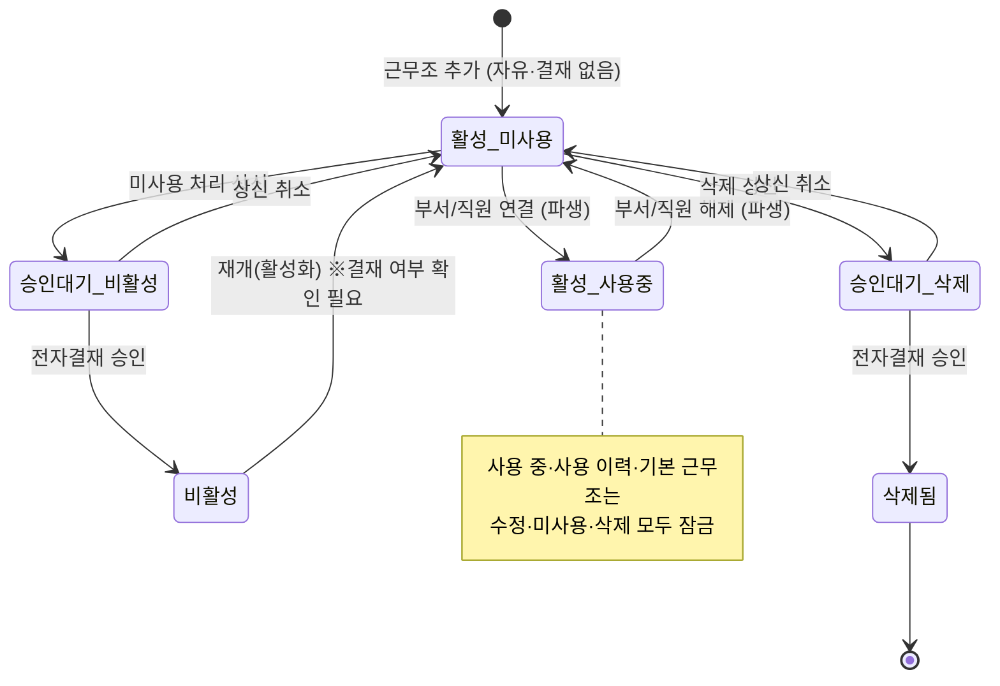

# 근무조 (WORK_SHIFT) 상태 전이

> 파일럿 산출물 — STEP 7 상태 정의
> 엔티티: [근무조 (WORK_SHIFT)](../entities/WORK_SHIFT_ENTITY.md)
> 기준일: 2026-07-16 · 근거 소스: `assets/js/att-shift-data.js` `codeFlags()`(`:278~300`), `submitCodeChange()`(`:977`), `approveCodeChange()`(`:987`), `activateCode()`(`:1003`)

---

## 1. 상태 모델 개요

근무조 상태는 **두 개의 독립 축**으로 관리된다. 화면 상태 뱃지는 두 축을 조합해 표기한다.

| 축 | 값 | 의미 | 판정 기준 |
|---|---|---|---|
| **사용 상태**(파생) | `사용 중(inuse)` / `미사용(unused)` / `승인대기(pending)` | 부서 연결·직원 배정 여부 | 사용 부서 수 + `pendingChange` 유무 |
| **활성 축** | `활성(active)` / `비활성(inactive)` | 배치 후보 포함/제외(폐기) | `active` 필드 |

> 사용 상태는 사용 부서 수에서 **파생**되는 값이라 직접 전이시키지 않는다(부서 연결·해제의 결과). 사용자가 직접 전이시키는 것은 **활성 축**(비활성화/재개)과 **삭제**다.

---

## 2. 상태 코드

| 상태 코드 | 표시명 | 업무 의미 | 상태 |
|---|---|---|---|
| `ACTIVE_INUSE` | 활성 · 사용 중 | 활성이며 1개 이상 부서에 연결/배정됨. 수정·미사용·삭제 불가(부서 해제 선행) | 확정 |
| `ACTIVE_UNUSED` | 활성 · 미사용 | 활성이나 사용 부서 0. 수정·비활성화·삭제 가능(사용 이력 없을 때) | 확정 |
| `PENDING` | 승인대기 | 삭제 또는 비활성화 전자결재 상신 후 승인 전. 추가 상신·편집 차단 | 확정 (`:287`, `:1071`) |
| `INACTIVE` | 비활성(폐기) | 배치 후보에서 제외. 재개(활성화)만 가능 | 확정 |
| `DELETED` | 삭제됨 | 목록에서 제거(변경 이력에는 존속) | 확정 |

> 부속 마커(뱃지) — `기본`(전사 기본 근무조), `사용 이력`(과거 배치·현재 미배치)은 상태 코드와 별개 축의 표기다. `사용 이력`이 있으면 수정·삭제가 잠긴다. (`page-att-settings.js:283~286`)

---

## 3. 상태 전이표

| 전이 | 이전 상태 | 다음 상태 | 전이 액션 | 실행 주체 | 필요 권한 | 변경 조건 | 금지 조건 | 후행 처리 | 취소·복구 | 상태 |
|---|---|---|---|---|---|---|---|---|---|---|
| 등록 | (없음) | 활성·미사용 | 근무조 추가 | 인사/근태 담당 | Create | 산정 기준 유효성 통과 | — | 마스터에 신규 코드 추가(자유·결재 없음) | 즉시 수정·삭제 가능 | 확정 (`saveAdd` `:952`) |
| 사용 연결 | 활성·미사용 | 활성·사용 중 | (부서 관리에서 기본 근무조 선택 / 직원 배정) | 담당 | Update(부서·직원) | 부서/직원에 연결 | — | 이후 수정·삭제 잠금 | 부서 해제 시 미사용 복귀 | 확정 (파생) |
| 사용 해제 | 활성·사용 중 | 활성·미사용 | (부서·직원에서 해제) | 담당 | Update(부서·직원) | 연결 부서 0으로 | — | 수정·비활성화·삭제 재허용 | — | 확정 (파생) |
| 비활성화 상신 | 활성·미사용 | 승인대기 | 근무조 미사용 처리 | 담당 | 현행 Update | 사용 부서 0 + 활성 + 기본 아님 + 대기 아님 | 사용 중·기본·이미 대기 | `pendingChange` 설정, 캘린더/목록에 승인대기 표시 | 상신 취소(대기 해제) | 확정 (`canDeactivate` `:294`, `submitCodeChange` `:977`) |
| 비활성화 승인 | 승인대기 | 비활성 | (전자결재 승인) | 승인자(예: 김상무) | 결재 권한 | 결재 승인 | — | `active=false`, `usageLog`·`codeChangeLog` 기록 | 재개로 복구 | 확정 (`approveCodeChange` `:987~999`) |
| 재개(활성화) | 비활성 | 활성·미사용 | 근무조 사용 재개 | 담당 | 현행 Update | 비활성 + 기본 아님 + 대기 아님 | 활성·기본·대기 | `active=true`, `usageLog` '활성' 기록 | 다시 비활성화 | 확정(코드 즉시) / 결재 여부 `추정·구현 확인` (`activateCode` `:1003` 즉시 vs 주석 `:213` 결재대상) |
| 삭제 상신 | 활성·미사용 | 승인대기 | 근무조 삭제 | 담당 | 현행 Delete | 사용 부서 0 + 사용 이력 없음 + 기본 아님 + 활성 + 대기 아님 | 사용 중·사용 이력·기본·대기 | `pendingChange` 설정 | 상신 취소 | 확정 (`canDelete` `:291`) |
| 삭제 승인 | 승인대기 | 삭제됨 | (전자결재 승인) | 승인자 | 결재 권한 | 결재 승인 | — | 목록에서 제거, `codeChangeLog` 존속 | 복구 불가(재등록) | 확정 |

---

## 4. 상태 전이도 (Mermaid)

---

## 5. 금지 전이 (Guard)

| 대상 | 금지 | 근거 |
|---|---|---|
| 사용 중(`inuse`) | 수정·미사용·삭제 | 부서에서 먼저 해제해야 함 (`codeInUse` `:263`) |
| 사용 이력(`everUsed`) | 수정·삭제 | 근태 산정 기준 보존 (`codeHasHistory` `:264`) |
| 전사 기본(`isDefault`) | 수정·미사용·삭제 | 유일 기본 근무조 보호 (`codeFlags` `:283`) |
| 승인대기(`pending`) | 추가 상신·편집 | 중복 상신 방지 (`:1071`) |

---

## 6. 미결정 · 확인 사항

1. `추정·구현 확인` — 재개(활성화)의 전자결재 경유 여부. 코드는 즉시 반영(`activateCode`), 주석은 결재 대상.
2. `미결정` — 비활성화·삭제 승인 트랜잭션의 실제 백엔드 처리(현행 mock). 승인 즉시 반영 vs 적용일 예약(`promotePending`)의 근태 소급 영향.
3. `미결정` — 삭제됨 상태의 물리 삭제 vs 아카이브, 복구 불가 확정 여부.

---

_참조: [근무조 엔티티](../entities/WORK_SHIFT_ENTITY.md) · [근무조 정책](../policies/WORK_SHIFT_POLICY.md) · [ATT-WPL-001 화면 액션](../screens/ATT-WPL-001_ACTIONS.md)_
